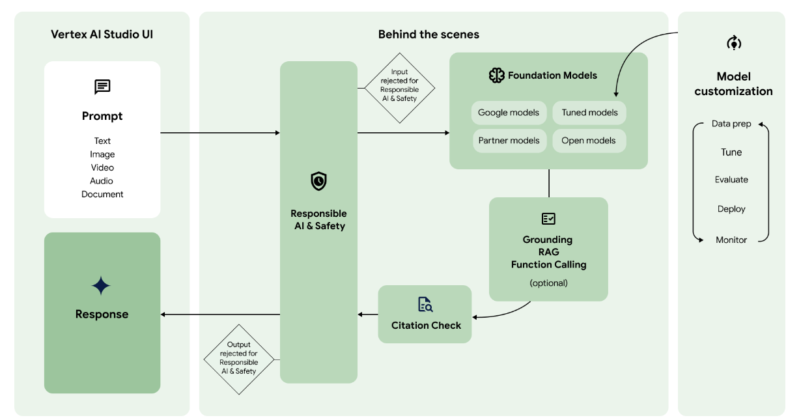

# 生成式 AI 初学者指南

本新手指南将向您介绍生成式 AI 的核心技术，并说明这些技术如何协同工作来为聊天机器人和应用提供支持。 生成式 AI（也称为 genAI）是机器学习 (ML) 的一个领域，用于开发和使用机器学习模型来生成新内容。

生成式 AI 模型通常称为大语言模型 (LLM)，因为它们规模庞大，并且能够理解和生成自然语言。 不过，根据模型训练所用的数据，这些模型可以理解和生成来自多种模态（包括文本、图片、视频和音频）的内容。处理多种数据模态的模型称为多模态模型。

Google 提供了专为多模态应用场景设计的 [Gemini](https://docs.cloud.google.com/vertex-ai/generative-ai/docs/models?hl=zh-cn#gemini-models) 系列生成式 AI 模型；能够处理来自多种模态（包括图片、视频和文本）的信息。

​  

## 内容生成

为了让生成式 AI 模型生成在实际应用中实用的内容，它们需要具备以下功能：

-   **了解如何执行新任务：**

生成式 AI 模型旨在执行一般任务。如果您希望模型执行您的应用场景特有的任务，则需要能够自定义模型。在 Vertex AI 上，您可以通过模型调优来自定义模型。

-   **访问外部信息：**

生成式 AI 模型使用大量数据进行训练。不过，为了让这些模型发挥作用，它们需要能够访问训练数据之外的信息。例如，如果您想创建由生成式 AI 模型提供支持的客户服务聊天机器人，则该模型需要能够访问有关您所提供产品和服务的信息。在 Vertex AI 中，您可以使用接地和函数调用功能来帮助模型访问外部信息。

-   **屏蔽有害内容：**

生成式 AI 模型可能会生成意料之外的输出，包括令人反感或不顾他人感受的文本。为了确保安全并防止滥用，模型需要安全过滤器来屏蔽被确定为可能有害的提示和回答。Vertex AI 具有内置安全功能，可促进负责任地使用我们的生成式 AI 服务。

下图展示了这些不同的功能如何协同工作，生成您所需的内容：

  

  

## 核心名词

### 提示

生成式 AI 工作流通常从提示开始。提示是发送到生成式 AI 模型以引出回答的自然语言请求。根据模型的不同，提示可以包含文本、图片、视频、音频、文档和其他模态，甚至包含多模态（多模态提示）。

创建提示以从模型获取所需回答的做法称为[提示设计](https://docs.cloud.google.com/vertex-ai/generative-ai/docs/learn/introduction-prompt-design?hl=zh-cn)。 虽然提示设计是一个试验和试错过程，但您可以利用提示设计原则和策略来智能调整模型，使其行为符合预期。[Vertex AI Studio](https://docs.cloud.google.com/vertex-ai/generative-ai/docs/start/quickstarts/quickstart?hl=zh-cn) 提供提示管理工具，可帮助您管理提示。

​  

### 基础模型

提示会发送到生成式 AI 模型以生成回答。 Vertex AI 具有可通过托管 API 访问的各种[生成式 AI 基础模型](https://docs.cloud.google.com/vertex-ai/generative-ai/docs/learn/models?hl=zh-cn)，包括：

-   **Gemini API**：高级推理、多轮聊天、代码生成和多模态提示。
-   **Imagen API**：图片生成、图片修改和视觉标注。
-   **MedLM**：医学问题回答和摘要。（**已弃用**）

这些模型的大小、模态和费用各有不同。您可以在 [Model Garden](https://docs.cloud.google.com/vertex-ai/docs/start/explore-models?hl=zh-cn) 中探索 Google 模型，以及 Google 合作伙伴提供的开放模型和其他模型。

​  

### 模型自定义

您可以自定义 Google 基础模型的默认行为，以便在不使用复杂提示的情况下始终生成所需的结果。此自定义过程称为[模型调优](https://docs.cloud.google.com/vertex-ai/generative-ai/docs/models/tune-models?hl=zh-cn)。模型调优可让您简化提示，从而帮助您降低请求的费用并缩短延迟时间。

Vertex AI 还提供[模型评估工具](https://docs.cloud.google.com/vertex-ai/generative-ai/docs/models/evaluate-models?hl=zh-cn)，可帮助您评估经过调优的模型的性能。在经过调优的模型可用于生产后，您可以像在标准 MLOps 工作流中一样[将其部署到端点](https://docs.cloud.google.com/vertex-ai/generative-ai/docs/deploy/overview?hl=zh-cn)并监控性能。

​  

### 访问外部信息

Vertex AI 提供多种方法，可让模型访问外部 API 和实时信息。

-   [**建立依据**](https://docs.cloud.google.com/vertex-ai/generative-ai/docs/grounding/overview?hl=zh-cn)：将模型回答连接到真实来源（例如您自己的数据或网页搜索），有助于减少幻觉。
-   [**RAG**](https://docs.cloud.google.com/vertex-ai/generative-ai/docs/learn/rag-access/rag?hl=zh-cn)：将模型连接到外部知识源（例如文档和数据库），以生成更准确的且信息丰富的回答。
-   [**函数调用**](https://docs.cloud.google.com/vertex-ai/generative-ai/docs/multimodal/function-calling?hl=zh-cn)：让模型与外部 API 交互，以获取实时信息并执行实际任务。

​  

### 引用检查

生成响应后，Vertex AI 会检查响应中是否需要包含[引用](https://docs.cloud.google.com/vertex-ai/generative-ai/docs/learn/responsible-ai?hl=zh-cn#citation_metadata)。如果响应中有大量文本来自特定来源，则该来源会添加到响应中的引用元数据。

​  

### Responsible AI 和安全

在返回提示和响应之前要经过的最后一层检查是[安全过滤器](https://docs.cloud.google.com/vertex-ai/generative-ai/docs/learn/responsible-ai?hl=zh-cn#safety_filters_and_attributes)。Vertex AI 会检查提示和回答，以了解提示或回答属于[安全类别](https://docs.cloud.google.com/vertex-ai/generative-ai/docs/learn/responsible-ai?hl=zh-cn#safety_attribute_descriptions)的程度。如果一个或多个类别超过阈值，则响应会被阻止，Vertex AI 将返回[后备响应](https://docs.cloud.google.com/vertex-ai/generative-ai/docs/learn/responsible-ai?hl=zh-cn#fallback_responses)。

​  

### 响应

如果提示和响应通过了安全过滤器检查，则系统会返回响应。通常，系统会一次性返回所有回答。但是，您还可以使用 Vertex AI 通过启用[流式传输](https://docs.cloud.google.com/vertex-ai/generative-ai/docs/multimodal/send-chat-prompts-gemini?hl=zh-cn#streaming-and-non-streaming-responses)来逐步接收生成的响应。

​
