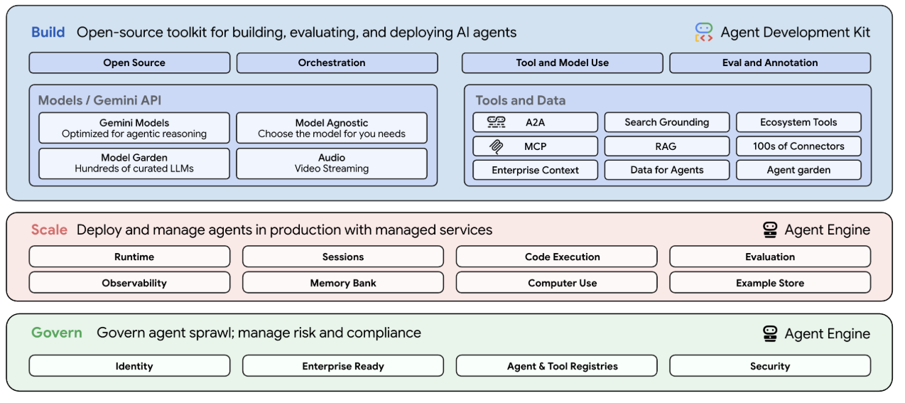

Vertex AI Agent Builder 是一套产品，可帮助开发者在生产环境中构建、扩缩和治理 AI 智能体。Vertex AI Agent Builder 提供全栈安全基础架构，可支持整个智能体生命周期：

-   **构建**：使用智能体开发套件 (ADK) 等框架或您选择的任何其他开源框架来构建智能体。

-   [**智能体开发套件 (ADK)**](https://google.github.io/adk-docs/) 是一种开源框架，可简化构建复杂多智能体系统的流程，同时保持对智能体行为的精确控制。
-   **Agent Garden**（[预览版](https://cloud.google.com/products?hl=zh-cn#product-launch-stages)中支持）是 Google Cloud 控制台中的一个库，您可以在其中查找和探索旨在加快开发速度的示例智能体和工具。在 Agent Garden 中，您可以找到以下内容：

-   **智能体**：这些是针对特定应用场景预构建的端到端解决方案。例如，您可能会找到专为客户服务、数据分析或创意写作而设计的智能体。这些智能体可随时使用，并且可以根据您的需求进行自定义。只有 Google 可以将智能体发布到 Agent Garden。如需使用 Garden 中的智能体，您可以选择该智能体并将其部署到您的项目中。
-   **工具**：您可以将这些单独的组件添加到自己的智能体中。工具提供特定功能，例如与数据库互动、调用外部 API 或执行搜索。您可以浏览 Agent Garden 中的可用工具，并将其集成到使用智能体开发套件 (ADK) 构建的智能体中。这样，您就可以扩展智能体的功能，而无需从头开始构建这些功能。

[前往 Agent Garden](https://console.cloud.google.com/vertex-ai/agents/agent-garden?hl=zh-cn)

-   **代理设计工具**（[预览版](https://cloud.google.com/products?hl=zh-cn&_gl=1*1drc221*_ga*MjA5NjY5MTk2OS4xNzY1NzAwMzc3*_ga_WH2QY8WWF5*czE3NzQxNzY3NDgkbzMkZzEkdDE3NzQxNzc2NDIkajMzJGwwJGgw#product-launch-stages)）是一款低代码可视化设计工具，可用于设计和测试代理。在[智能体开发套件](https://docs.cloud.google.com/agent-builder/agent-development-kit/overview?hl=zh-cn)中将开发过渡到代码之前，先在 Agent Designer 中试用智能体。

[前往代理设计工具](https://console.cloud.google.com/vertex-ai/agents/agent-designer?hl=zh-cn)

-   **规模化**：以全球安全规模将智能体部署到生产环境，并且内置测试、发布管理和可靠性功能。

-   [**Vertex AI Agent Engine**](https://docs.cloud.google.com/agent-builder/agent-engine/overview?hl=zh-cn) 是一组服务，可让开发者在生产环境中部署、管理和扩缩 AI 智能体。Vertex AI Agent Engine 提供全托管式运行时、评估、会话、记忆库和代码执行等服务。通过 [Google Cloud Trace](https://docs.cloud.google.com/vertex-ai/generative-ai/docs/agent-engine/manage/tracing?hl=zh-cn)（支持 [OpenTelemetry](https://opentelemetry.io/)）、[Cloud Monitoring](https://docs.cloud.google.com/vertex-ai/generative-ai/docs/agent-engine/manage/monitoring?hl=zh-cn) 和 [Cloud Logging](https://docs.cloud.google.com/vertex-ai/generative-ai/docs/agent-engine/manage/logging?hl=zh-cn) 了解智能体行为。
-   **智能体工具**是您可以为 ADK 智能体配备以供使用的工具，包括：

-   [内置工具](https://google.github.io/adk-docs/tools/built-in-tools/)，例如[依托 Google 搜索进行接地](https://docs.cloud.google.com/vertex-ai/generative-ai/docs/multimodal/ground-with-google-search?hl=zh-cn)、[Vertex AI Search](https://docs.cloud.google.com/generative-ai-app-builder/docs/enterprise-search-introduction?hl=zh-cn) 和[代码执行](https://docs.cloud.google.com/vertex-ai/generative-ai/docs/multimodal/code-execution?hl=zh-cn)
-   [RAG 引擎](https://docs.cloud.google.com/vertex-ai/generative-ai/docs/rag-quickstart?hl=zh-cn#run-rag)，适用于检索增强生成 (RAG)
-   [Google Cloud 工具](https://google.github.io/adk-docs/tools/google-cloud-tools/)，用于连接到以下目标：

-   在 [Apigee API hub](https://docs.cloud.google.com/apigee/docs/apihub/what-is-api-hub?hl=zh-cn) 中托管的 API
-   通过 [Integration Connectors](https://docs.cloud.google.com/integration-connectors/docs/all-integration-connectors?hl=zh-cn) 集成的 100 多种企业应用
-   通过 [Application Integration](https://docs.cloud.google.com/application-integration/docs/overview?hl=zh-cn) 进行的自定义集成

-   [Model Context Protocol (MCP) 工具](https://google.github.io/adk-docs/tools/mcp-tools/)
-   [生态系统工具](https://google.github.io/adk-docs/tools/third-party-tools/)，例如 LangChain 工具、CrewAI 工具和 [GenAI Toolbox for Databases](https://github.com/googleapis/genai-toolbox)

-   **监管**：通过端到端的可观测性功能，利用审核轨迹监控代理在做什么。

-   **使用 Security Command Center 检测威胁**：[Agent Engine 威胁检测](https://docs.cloud.google.com/security-command-center/docs/agent-engine-threat-detection-overview?hl=zh-cn)（预览版）是 Security Command Center 的一项内置服务，可帮助您检测和调查部署到 Vertex AI Agent Engine 运行时的代理可能遭受的攻击。
-   [**代理身份**](https://docs.cloud.google.com/agent-builder/agent-engine/agent-identity?hl=zh-cn)（预览版）：在 Vertex AI Agent Engine 运行时中使用代理时，使用 [Identity Access Management (IAM)](https://docs.cloud.google.com/iam/docs/overview?hl=zh-cn) 代理身份来提供安全和访问权限管理功能。
-   [**Cloud API Registry 中的工具**](https://docs.cloud.google.com/api-registry/docs/console?hl=zh-cn)（预览版）：在 Google Cloud 控制台中使用 Cloud API Registry 查看和管理代理可访问的 MCP 服务器和工具。

下图展示了 Vertex AI Agent Builder 的组件：

如需详细了解 AI 智能体，请参阅以下内容：

-   关于[使用 Vertex AI 的多智能体系统](https://cloud.google.com/blog/products/ai-machine-learning/build-and-manage-multi-system-agents-with-vertex-ai?hl=zh-cn)的博文
-   [什么是 AI 智能体？](https://cloud.google.com/discover/what-are-ai-agents?hl=zh-cn)
-   [Vertex AI Agent Builder](https://cloud.google.com/products/agent-builder?hl=zh-cn)

## 构建和部署智能体的工作流

1.  在 [Agent Garden](https://console.cloud.google.com/vertex-ai/agents/agent-garden?hl=zh-cn) 中发现适合您应用场景的智能体示例和工具。
2.  使用智能体开发套件构建和测试智能体。
3.  将智能体部署到 Vertex AI Agent Engine。
