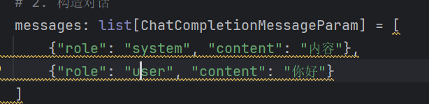

## print("模型回复：", response.choices[0].message.content)是什么意思？

当你执行完 `client.chat.completions.create` 后，大模型返回的不是一个简单的字符串，而是一个嵌套很深的 **JSON 对象（字典）**。

这行代码的作用是：**像剥洋葱一样，从复杂的返回数据中精准地挖出 AI 说给你的那句话。**

我们可以把这个结构拆解开来看：

---

### 1\. 结构拆解（从外到内）

-   `**response**`: 这是 API 返回的整个大包（一个 `ChatCompletion` 对象）。它包含了模型名称、Token 消耗统计、完成原因以及最重要的——回复内容。
-   `**.choices**`: 这是一个 **列表（List）**。因为 API 支持让 AI 一次性生成多个不同的版本（比如你可以要求 `n=3`，让它给你三个不同的方案），所以它是个数组。
-   `**[0]**`: 取列表里的第一个。在 99% 的场景下，我们只需要 AI 给出的第一个（也是最稳的）回答。
-   `**.message**`: 这是一个消息对象。它不仅包含文本，还包含 `**role**`（角色，通常是 `assistant`）以及 `**tool_calls**`（如果 AI 决定调用工具，指令会藏在这里）。
-   `**.content**`: 这才是最终的 **纯文本回复**。也就是你在控制台看到的“你好！有什么我能帮助你的吗？”。

---

### 2\. 如果不加这一长串会怎样？

如果你直接 `print(response)`，你会看到类似这样的“原始数据怪兽”：

```plain
{
  "id": "chatcmpl-123",
  "choices": [
    {
      "finish_reason": "stop",
      "index": 0,
      "message": {
        "content": "你好！有什么我能帮助你的吗？",
        "role": "assistant"
      }
    }
  ],
  "usage": {
    "completion_tokens": 17,
    "prompt_tokens": 13,
    "total_tokens": 30
  }
}
```

显然，你的最终用户（或者你的日志分析界面）只想看 `content` 里的那一句话。

---

### 3\. 在 Agent 开发中的特殊意义

作为 **AIOps 开发者**，你之后会频繁用到这个结构的**同级兄弟**。

当你开始做 **Function Calling** 时，你的代码会变成这样：

-   **如果 AI 想说话：** 结果在 `response.choices[0].message.content` 里。
-   **如果 AI 想查日志（动用工具）：** 结果在 `response.choices[0].message.tool_calls` 里。

所以，学会精准定位这个路径，是你控制 Agent “大脑”的第一步。

---

### 4\. 建议：更健壮的写法

在真实的生产环境（比如你正在做的分布式平台）中，有时候 API 可能会因为各种原因没返回内容。为了防止程序报错崩溃，资深开发者有时会这样写：

```plain
# 获取消息对象
msg = response.choices[0].message

# 如果有文本内容则打印
if msg.content:
    print(f"AI 回复: {msg.content}")

# 如果 AI 决定调用工具 (Agent 逻辑)
if msg.tool_calls:
    print("AI 正在尝试调用工具...")
```
---

## 为什么messages的类型经常错误？

## 

看到控制台输出那句“你好！有什么我能帮助你的吗？”，恭喜你，**你的代码逻辑已经完全跑通了！**

至于为什么“满屏警告”却能正常运行，这涉及到 Python 语言的一个核心特性：**Python 是动态语言，它的类型检查和代码运行是完全脱钩的。**

---

### 1\. 为什么“带病”也能跑？

在 Python 的世界里，VS Code 的那些红线/黄线叫 **“静态分析（Static Analysis）”**。

-   **VS Code 的角色：** 它像是一个极其死板的“校对员”。它拿着 OpenAI 的说明书，发现你写的 `messages` 格式跟说明书上的复杂定义对不上（虽然内容是对的），所以它疯狂打小报告，提醒你“这里可能不规范”。
-   **Python 解释器的角色：** 它才是真正的“执行官”。它在运行时根本不看 VS Code 的警告。它只看：`client` 是不是对象？`create` 是不是方法？发送的 JSON 格式阿里云百炼能不能听懂？
-   **结果：** 阿里云百炼收到了你的 JSON，觉得格式没问题，就返回了答案。所以程序运行完美，只是“校对员”在旁边生闷气。

---

### 2\. 这种情况在开发中常见吗？

**非常常见。** 特别是在以下两种情况：

1.  **SDK 定义太复杂：** OpenAI 的消息类型定义嵌套了好几层（也就是你弹窗里那一长串 `Iterable[...]`），VS Code 的插件（Pylance）有时解析不过来，就会报错。
2.  **动态构建数据：** 当你用字典（dict）去凑模型需要的对象时，静态检查器往往无法预知你运行时的字典内容。

---

### 3\. 既然能跑，我需要管这些警告吗？

作为一名大学生和未来的开发者，建议采取 **“分阶段对待”** 的策略：

-   **学习/实验阶段（现在）：****可以不管。** 只要控制台能输出结果，说明你对业务逻辑（API 调用、配置注入）的理解是对的。不要让这些类型警告打断你的学习心流。
-   **正式项目/工程阶段：****建议消灭。** 因为警告多了会掩盖真正的“语法错误”。如果你不小心把 `model` 拼成了 `modle`，它也会报类似的警告，那时候代码就真的跑不通了。

---

### 4\. 如何优雅地让“校对员”闭嘴？

如果你实在看着那几行红线不顺眼，最直接、最符合 Python 风格的方法是在那一行的末尾加上 `# type: ignore`：

```plain
messages: list[ChatCompletionMessageParam] = [
    {"role": "system", "content": "内容"},
    {"role": "user", "content": "你好"}
] # type: ignore
```

这行注释相当于告诉 VS Code：“我知道你在担心什么，但我确定没问题，闭嘴吧。”

---
