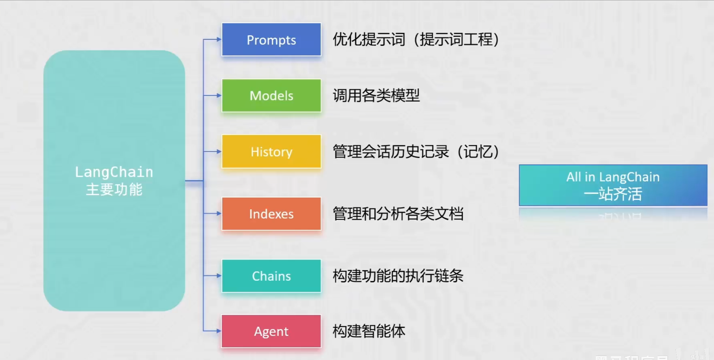

如果你在 **Agent 开发**的路上走得够深，迟早会撞上 **LangChain**。

简单来说，LangChain 是目前全球最流行的 **AI 应用开发框架**。如果把大模型（LLM）比作一颗“大脑”，那么 LangChain 就是一套极其复杂的“义体系统”——它提供了连接数据库、记忆管理、工具链调度和工作流控制的所有组件。

但在你开始学之前，我必须给你一个**橙色警告**：LangChain 非常强大，但也因“过度封装”而臭名昭著。对于初学者，它有时会让简单的逻辑变得极其晦涩。



---

## 1\. LangChain 的核心六大模块

LangChain 把 Agent 开发拆成了六块积木：

| **模块名称** | **作用** | **你的运维场景示例** |
| --- | --- | --- |
| **Model I/O** | 管理提示词和模型调用 | 统一调用 OpenAI 或 阿里云百炼 的接口。 |
| **Retrieval (RAG)** | 向量数据库连接 | 把 K8s 排障手册切片并存入数据库。 |
| **Chains (链)** | 把多个动作串起来 | 1. 查日志 -> 2. 总结错误 -> 3. 发钉钉。 |
| **Memory (记忆)** | 让 AI 记住之前的对话 | 在多轮排障中记住上一步查出的 IP 地址。 |
| **Agents (智能体)** | 自动决策中心 | 让 LLM 决定该调哪个工具，还是直接回答。 |
| **Callbacks (回调)** | 监控与日志 | 记录 AI 每一轮思考花了多少钱、多少时间。 |

---

## 2\. 为什么大家都在用它？（核心优势）

1.  **极速原型**：如果你想做一个“基于本地文档的聊天机器人”，用原生代码可能要写 100 行，用 LangChain 的 `RetrievalQA` 可能只需要 10 行。
2.  **模型中立**：今天用百炼的 Qwen，明天想换 DeepSeek，你只需要改一行配置，不需要重写解析逻辑。
3.  **生态丰富**：它几乎集成了市面上所有的向量数据库（Milvus, Pinecone）和工具（Google Search, GitHub, SQL）。

---

## 3\. LangChain 怎么用？（极简三步走）

虽然它很复杂，但入门通常遵循这个逻辑：

## 第一步：安装环境

```plain
pip install langchain langchain-openai
```

## 第二步：定义 Chain（链）

这是最基础的用法：把 Prompt 和 LLM 焊在一起。

```plain
from langchain_openai import ChatOpenAI
from langchain_core.prompts import ChatPromptTemplate

# 1. 初始化模型（指向你的百炼地址）
llm = ChatOpenAI(api_key="KEY", base_url="百炼URL", model="qwen-max")

# 2. 定义模板
prompt = ChatPromptTemplate.from_template("你是一个 K8s 专家，请简要解释 {topic}")

# 3. 组合成链 (使用管道符号 | 是 LangChain 的特色)
chain = prompt | llm

# 4. 调用
response = chain.invoke({"topic": "Ingress"})
print(response.content)
```

## 第三步：定义 Agent（真正的自动驾驶）

LangChain 会自动帮你处理我们之前聊过的那个复杂的“JSON 拦截-执行-再请求”循环。

---

## 4\. 给你的建议：学还是不学？

根据你之前提到的**四阶段计划**，我的建议是：

-   **现在（第一/二阶段）**：**不要用 LangChain。** 继续用原生的 `openai` 库。因为只有手写过 `tool_calls` 的解析，你才能理解 LangChain 在背后到底帮你掩盖了多少“坑”。
-   **后期（第三/四阶段）**：**学习 LangGraph。** 它是 LangChain 团队推出的新一代框架，比传统的 LangChain 更适合做复杂的 AIOps 工作流。

---

## 总结：LangChain 的本质

**LangChain = 各种 AI 工具的“粘合剂”。** 它把复杂的 `JSON Schema` 封装成了简单的 `Tool` 类，把复杂的 `messages` 拼接封装成了 `Memory` 类。

**既然你对框架感兴趣，我们要不要试着模拟一下 LangChain 的“链式思考”？** 我们可以写一段简单的代码，模拟“先提取关键词，再根据关键词查手册”的两个步骤。你想看看这种“链式”逻辑在原生代码里是怎么实现的吗？
