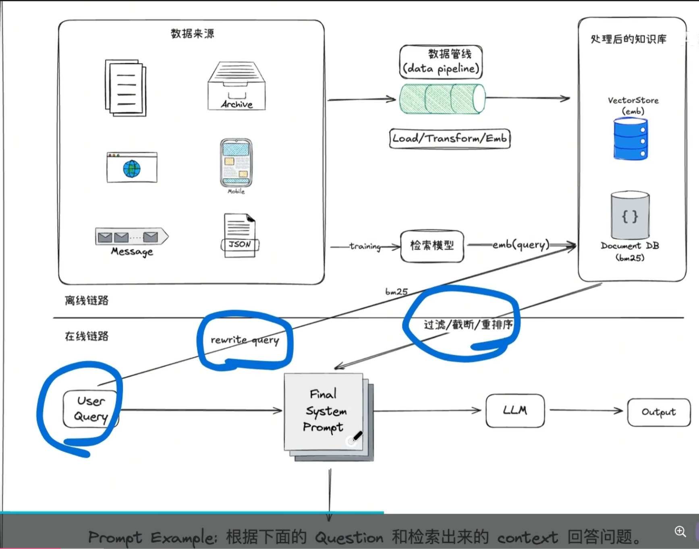
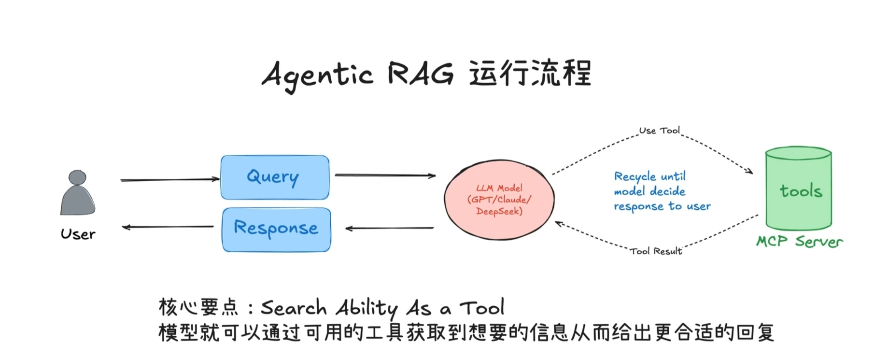

  

简单来说，**Agentic RAG** 是传统 RAG（检索增强生成）的“进化版”。

如果说传统 RAG 是一个“死板的资料员”**（你问什么，他查什么，查不到也硬着头皮回），那么 Agentic RAG 就是一个**“聪明的调查记者”。

---

## 1\. 核心区别：直觉 vs. 逻辑

## 传统 RAG (Standard RAG)

-   **流程：** 用户提问 -> 向量搜索 -> 检索 Top-K 文档 -> 丢给 AI 总结。
-   **缺点：** 如果检索到的文档质量差，或者问题很复杂（需要查好几次），它就瞎编（幻觉）。它没有“反思”能力。

## Agentic RAG

-   **流程：** 用户提问 -> **Agent 思考 (Planning)** -> 决定去哪查 -> **检查检索结果 (Evaluation)** -> 如果不够好，换个关键词再查 -> 汇总信息 -> 回答。
-   **核心：** 它引入了 **推理 (Reasoning)** 和 **迭代 (Iteration)**。

---

## 2\. Agentic RAG 的“超能力”

在你开发的 **AIOps 分布式平台**背景下，Agentic RAG 的优势非常明显：

1.  **多步检索 (Multi-hop Retrieval)：**

用户问：“昨晚 Kafka 堆积的原因是什么？”

-   **第一步：** Agent 查 Kafka 监控日志。
-   **第二步：** 发现有网络抖动，Agent 自动决定再去查网络设备的 Syslog。
-   **第三步：** 综合两边信息，得出结论。
-   *传统 RAG 只能查一次，通常只能给你一半答案。*

2.  **自我修正 (Self-Correction)：**

如果 Agent 检索出来的文档和问题完全不相关，它会通过 **Router（路由）** 发现：“不对，这资料没用”，然后重新调整搜索词再次尝试。

3.  **自适应工具调用：**

它不只查向量数据库。它可能决定：

-   调用 **SQL 工具** 查数据库指标。
-   调用 **Local Shell** 查看当前进程。
-   调用 **Vector DB** 查历史故障案例。

---

## 3\. 技术实现栈

要实现 Agentic RAG，通常需要在你现有的 `openai` 库基础上增加以下组件：

-   **Router（路由）：** 决定这个请求是该查文档，还是该调 API。
-   **Query Rewriter（查询重写）：** 把用户的模糊提问转换成更专业的搜索词。
-   **Reasoning Loop（推理循环）：** 经典的 `Thought -> Action -> Observation` 循环。

---

## 4\. 为什么它对你的项目很重要？

你正在做“分布式智能日志分析”。

传统的 RAG 只能帮你从“知识库”里找现成的文档。但 **Agentic RAG 可以实时地在你的分布式集群里“探路”**。

**举个例子：**

当你的平台收到一个报警，Agentic RAG 可以先检索“历史类似故障”，如果发现匹配度不高，它会自动触发一个 `ls -l` 或 `top` 命令去获取实时状态，再把这些实时状态作为“动态文档”进行 RAG 分析。

---

## 总结

**Agentic RAG = 传统 RAG + 思考能力 + 自主工具使用。**

它让 AI 不再只是一个“读书人”，而变成了一个能够**一边查阅资料、一边动手实操**的运维工程师。

**既然你已经跑通了基础对话，我们要不要试着写一个“极简版”的 Agentic 逻辑？比如：让 AI 先判断用户的问题需不需要查日志，如果需要，它才去调用你写的工具。** 这种“按需决策”就是 Agentic RAG 的雏形。你要试试吗？
