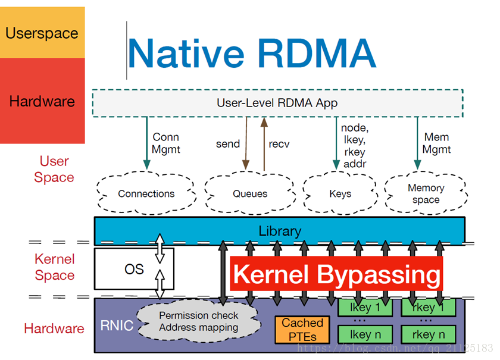

梓涵，既然你已经了解了 InfiniBand 和 RoCE，那 **RDMA** 就是它们共同的“核心灵魂”。

简单来说，**RDMA (Remote Direct Memory Access)**，翻译过来就是 **“远程直接内存访问”**。它是分布式计算和 AI 基础设施中最重要的网络黑科技之一。

---

## 1\. 为什么需要 RDMA？（传统网络的“痛”）

在传统的 **TCP/IP** 网络中，数据搬运是一个非常累人的过程：

1.  **多次拷贝**：数据要从网卡拷到内核内存，再从内核内存拷到用户程序的内存。
2.  **CPU 疯狂打工**：每一次数据包的拆解、封装和拷贝，都需要 CPU 亲自下场处理中断。
3.  **高延迟**：这一来二去，时间都浪费在“搬运”和“等待 CPU”上了。

在 AI 训练时，如果你有 1000 块 GPU 要交换数据，如果还用 TCP/IP，那 CPU 全在搬运数据了，根本没空管模型。

---

## 2\. RDMA 是怎么解决的？（“顺丰直达”）

RDMA 的核心思想是：**“绕过 CPU，直接送货上门。”**

它的工作流程是：

-   **零拷贝 (Zero-copy)**：数据直接从一台机器的应用程序内存，通过网卡，直接写到另一台机器的应用程序内存中。
-   **内核旁路 (Kernel Bypass)**：不需要进入复杂的 Linux 内核协议栈。网卡直接和用户态程序对话。
-   **CPU 卸载 (CPU Offload)**：数据传输过程中，两边的 CPU 都在“睡觉”或者干别的活，完全不参与搬运。

**比喻**：

-   **传统方式**：你要给邻居送快递，得先送去邮局（内核），邮局分拣后再送去邻居家的收发室，邻居再去拿。
-   **RDMA 方式**：你直接拿着邻居家的备用钥匙（内存地址权限），把快递轻轻放在他卧室的桌子上。

---

## 3\. RDMA 的三大支柱

要实现这种“直达”效果，需要依靠：

1.  **RNIC (RDMA 网卡)**：特殊的网卡硬件，具备直接读写内存的逻辑。
2.  **队列对 (Queue Pair, QP)**：发送端和接收端建立的直接通信通道。
3.  **内存注册 (Memory Registration)**：程序必须提前告诉网卡，哪块内存区域是允许远程访问的，以保证安全。

---

## 4\. RDMA 的三种实现方式

你在上一条提问中见到的技术，其实就是 RDMA 的不同“马甲”：

-   **InfiniBand (IB)**：RDMA 的原生形态，性能最强，但硬件最贵。
-   **RoCE (v1/v2)**：让 RDMA 跑在以太网上。目前 AI 推理和云数据中心最主流的选择。
-   **iWARP**：通过 TCP 协议跑 RDMA。延迟略高，但对网络要求低，现在用得比较少了。

---

## AIOps 总结点

在你的博客中，你可以这样给读者科普 RDMA 的意义：

“在分布式智能体协作或大模型推理中，**RDMA** 是解决‘通讯墙’的关键。它实现了**计算（CPU/GPU）与传输（Network）的彻底解耦**。有了 RDMA，网络传输不再是系统的负担，而变成了几乎透明的‘内存扩展’。这就是为什么我们能在大规模集群上实现亚毫秒级响应的底层逻辑。”

---
