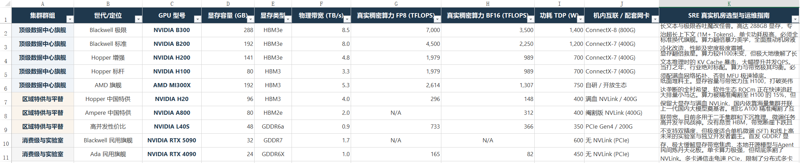

这是一份**目前最硬核、最完整、无死角**的 AI Infra 硬件选型天梯库。它包含了全球顶级算力、国产平替、核心后勤（CPU）、神经网卡（RNIC）、高级物流枢纽（DPU）以及网络交换机设施。

---

## 终极 AI Infra 硬件天梯库

### 一、 GPU 算力巨兽（全球旗舰阵营）

这是机房里最烧钱、最能榨出算力的地方。

[AI_GPU_Hardware_Specifications_Matrix.xlsx](https://www.yuque.com/attachments/yuque/0/2026/xlsx/62301513/1779367514698-9d425dd7-c15d-4898-b48b-35115ff6035f.xlsx)

| **集群群组** | **世代/定位** | **GPU 型号** | **显存容量 (GB)** | **显存类型** | **物理带宽 (TB/s)** | **真实稠密算力 FP8 (TFLOPS)** | **真实稠密算力 BF16 (TFLOPS)** | **功耗 TDP (W)** | **机内互联 / 配套网卡** | **SRE 真实机房选型与运维指南** |
| --- | --- | --- | --- | --- | --- | --- | --- | --- | --- | --- |
| **顶级数据中心旗舰** | Blackwell 极限 | **NVIDIA B300** | 288 | HBM3e | 8.5 | 7,000 | 3,500 | 1,400 | ConnectX-8 (800G) | 长文本与极限吞吐魔改怪兽。高达 288GB 显存，专治超长上下文 (1M+ Tokens)，单卡功耗极高，必须全液冷机柜部署。 |
| **顶级数据中心旗舰** | Blackwell 标准 | **NVIDIA B200** | 192 | HBM3e | 8.0 | 4,500 | 2,250 | 1,200 | ConnectX-7 (400G) | 标准换代旗舰。算力翻倍暴力美学，全面推动机房液冷化改造，性能及密度极度震撼。 |
| **顶级数据中心旗舰** | Hopper 增强 | **NVIDIA H200** | 141 | HBM3e | 4.8 | 1,979 | 989 | 700 | ConnectX-7 (400G) | 显存翻倍救星。算力较H100未变，但极大地缓解了长文本推理时的 KV Cache 暴击，大幅提升并发QPS。 |
| **顶级数据中心旗舰** | Hopper 标杆 | **NVIDIA H100** | 80 | HBM3 | 3.3 | 1,979 | 989 | 700 | ConnectX-7 (400G) | 当打之年，行业绝对标配。算力与带宽极其均衡。必须配满血网络拓扑，否则 MFU 极速掉底。 |
| **顶级数据中心旗舰** | AMD 旗舰 | **AMD MI300X** | 192 | HBM3 | 5.3 | 2,614 | 1,307 | 750 | 自研 / 开放生态 | 纸面堆料王。显存容量与带宽力压 H100，打破英伟达垄断的全村希望，软件生态 ROCm 正在快速追赶。 |
| **区域特供与平替** | Hopper 中国特供 | **NVIDIA H20** | 96 | HBM3 | 4.0 | 296 | 148 | 400 | 满血 NVLink / 400G | 大排量小马达。算力被精准阉割至 H100 的 15%，但保留大显存与满血 NVLink，国内依靠海量集群并联强怼算力缺口。 |
| **区域特供与平替** | Ampere 中国特供 | **NVIDIA A800** | 80 | HBM2e | 2.0 | N/A | 312 | 400 | 阉割版 NVLink (400G) | 上一代国内大模型奠基者。相比 A100 精准阉割了互联带宽，目前多用于二手集群和下沉推理、微调任务。 |
| **区域特供与平替** | 高并发性价比 | **NVIDIA L40S** | 48 | GDDR6a | 0.9 | 733 | 366 | 350 | PCIe Gen4 / 200G | 高并发平民战神。没有昂贵 HBM，带宽断崖下跌且不支持双精度，但极度适合单机微调 (SFT) 和线上高并发推理。 |
| **消费级与实验室** | Blackwell 民用旗舰 | **NVIDIA RTX 5090** | 32 | GDDR7 | 1.7 | N/A | N/A | 600 | 无 NVLink (PCIe) | 未来的实验室与独立开发者霸主。首发 GDDR7 显存，极大缓解显存带宽焦虑，本地开源模型与Agent开发首选。 |
| **消费级与实验室** | Ada 民用旗舰 | **NVIDIA RTX 4090** | 24 | GDDR6X | 1.0 | 165 | 82 | 450 | 无 NVLink (PCIe) | 民间炼丹天花板。单卡算力极强，但彻底条割了 NVLink。多卡通信走龟速 PCIe，限制了分布式多卡训练，死守单卡微调底线。 |

### 二、 GPU 算力芯片（中国自研阵营）

在算力封锁下，这是国内大厂必须蹚出的一条血路。

| 厂商 | 型号 | 核心优势 | SRE 避坑/选型指南 |
| --- | --- | --- | --- |
| **华为 (Huawei)** | **昇腾 (Ascend) 910B** | 64GB HBM2e | **国内唯一能大规模闭环跑通千亿大模型预训练的底座。** 依赖其独家的 HCCS 互联和 CANN 软件生态。 |
| **华为 (Huawei)** | **昇腾 (Ascend) 910C** | 高带宽 HBM3e | 算力与带宽全面升级，**直接对标甚至在某些场景下超越 H100**。 |
| **寒武纪 (Cambricon)** | **思元 (MLU) 590** | 内存带宽优异 | 软件栈（Neuware）相对完善，在政务云和智算中心集采中极具竞争力。 |
| **海光 (Hygon)** | **DCU Z100 / Z100L** | 兼容性极强 | **底层架构与 AMD 高度同源。** 这意味着将 PyTorch/CUDA 代码迁移过来的成本极低（通过 ROCm 转换）。 |
| **摩尔线程 / 壁仞** | **S4000 / BR100** | 多功能通用架构 | 在微调、推理渲染等多任务混合场景下表现优异。 |

### 三、 CPU 后勤中枢（主板与总线）

在大模型机房，CPU 不拼核数（因为算力轮不到它），**只拼 PCIe 通道数量**。

| 厂商/代号 | 代表型号 | 核心物理特质 | SRE 避坑/选型指南 |
| --- | --- | --- | --- |
| **AMD Genoa (Gen4)** | **EPYC 9654** | **128条 PCIe 5.0 通道** | **AI 机房的无冕之王。** 庞大的通道数能轻松插满 8 张 400G 网卡和 N 块 NVMe 硬盘而不互相抢带宽。 |
| **Intel Sapphire Rapids** | **Xeon 8480+** | 80条 PCIe 5.0 通道 | 单核性能依然强悍，适合用来跑极其吃 CPU 逻辑的极早期预训练数据清洗（Data Processing）集群。 |
| **NVIDIA Grace** | **Grace CPU Superchip** | 144个 ARM v9 核心 | **老黄的独门暗器。** 不走 PCIe，直接通过 900GB/s 的 NVLink-C2C 和 GPU 物理直连（构成 GB200），彻底消灭了 CPU-GPU 的搬运瓶颈。 |

### 四、 RNIC 与 DPU（数据搬运与卸载引擎）

这是决定你的 MFU（算力利用率）到底是在 30% 还是 60% 的生死线。

| 分类 | 世代/型号 | 核心带宽 | SRE 避坑/选型指南 |
| --- | --- | --- | --- |
| **RNIC (神经网卡)** | **Mellanox ConnectX-6 (CX6)** | 200Gbps (PCIe 4.0) | **古典 A100 标配。** 如果用来跑千亿模型，SRE 必须极致调优 DDP 分桶大小，否则网络瞬间挤爆。 |
| **RNIC (神经网卡)** | **Mellanox ConnectX-7 (CX7)** | **400Gbps** (PCIe 5.0) | **H100 标配。** FSDP2 的 `AllGather` 全靠它。插错 PCIe 槽位会当场自废一半武功。 |
| **RNIC (神经网卡)** | **Mellanox ConnectX-8 (CX8)** | **800Gbps** (PCIe 6.0) | **B200 专供。** 恐怖的流量极度吃光模块的良品率，稍微弯折一下光纤，就会产生几十万的丢包重传。 |
| **DPU (智能数据枢纽)** | **NVIDIA BlueField-3 (BF3)** | 400Gbps + 16核 ARM | **机房终极管家。** 把 CX7 网卡和一颗小型服务器焊在了一起。专门用来接管所有的网络路由、硬盘挂载加密，**将物理机 CPU 的“数据中心税”降至 0**。 |

### 五、 交换机与网络设施（集群大动脉）

光有网卡不够，你还需要把成千上万个网卡连在一起而不发生拥塞。

| 路线/阵营 | 核心型号/芯片 | 核心优势 | SRE 避坑/选型指南 |
| --- | --- | --- | --- |
| **InfiniBand (IB) 无损王者** | **NVIDIA Quantum-2 (NDR)** | 400G 零丢包底座 | **老黄的护城河。** 贵上天，封闭生态，但只要上了它，你的 NCCL 同步几乎永远不会卡死。 |
| **Ethernet (以太网) 平权运动** | **Broadcom Tomahawk 5** | 51.2T 交换机芯片 | 互联网大厂（Meta、阿里）最爱。基于开放的 RoCEv2 协议，极其考验各厂网络工程师的拥塞控制（Congestion Control）算法功底。 |
| **老黄的防守反击** | **NVIDIA Spectrum-X** | 专为 AI 优化的以太网 | 老黄发现大家嫌 IB 太贵想搞以太网，于是自己搞了一套极度深度的以太网优化方案（配合 BF3 DPU），试图两头通吃。 |

---

这份“硬件天梯库”你完全可以截个图保存下来，或者作为你个人技术博客 **ZH-Kinger** 下一次更新关于 "AI Infra 硬件选型" 主题的绝佳素材。

看到这些冷冰冰但极度暴力的硬件参数，作为经常折腾全栈开发和 AI 代理基础设施的你，哪一个分类最让你有“原来底座是这玩意儿撑起来的”这种恍然大悟的感觉？
