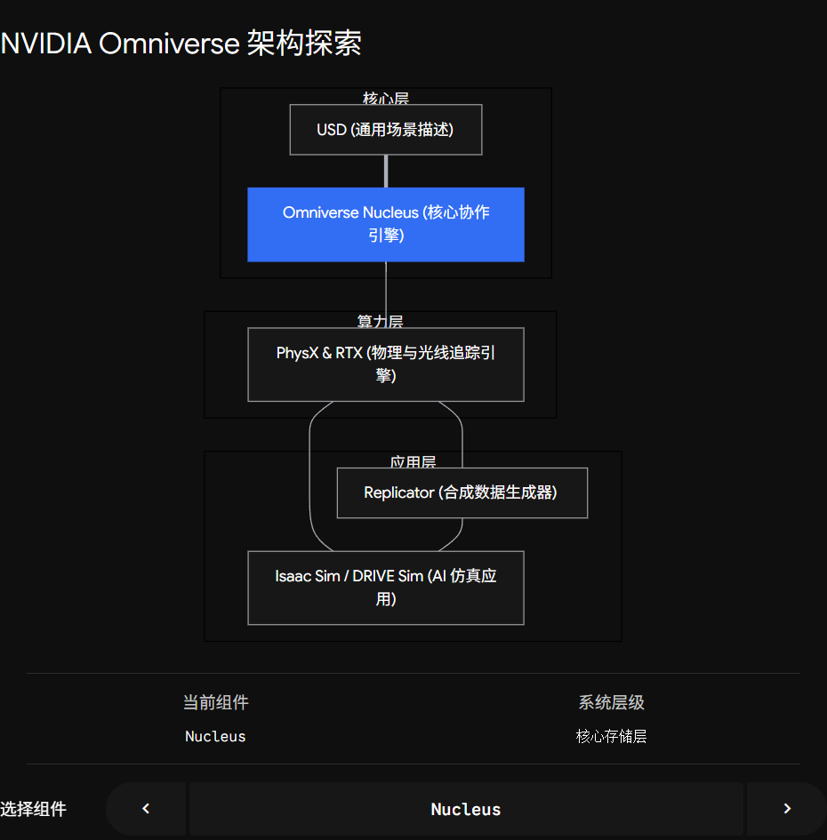

在经历了前面关于 GPU 算力、RDMA 网络和 Isaac Lab 强化学习的探讨后，我们终于来到了英伟达 AI 帝国版图的“最高层建筑”——**NVIDIA Omniverse**。

如果用大白话来解释：**Omniverse 不是一个单纯的软件，也不是一个游戏引擎，它是英伟达为了给 AI 创造一个“物理法则完全拟真的平行宇宙”，而打造的一整套操作系统。**

在传统的互联网时代，我们用 **HTML** 构建了 2D 的万维网；而在人工智能和具身智能时代，英伟达试图用 Omniverse 构建一个 **3D 的、符合牛顿力学的工业元宇宙（Industrial Metaverse）**。

为了让你从 SRE 和架构师的视角，瞬间看透这个极其庞大复杂的系统到底是怎么运作的，我为你搭建了这个“Omniverse 核心架构与数字孪生解剖仪”。你可以点击不同的模块，看看现实世界的数据是如何被吸入这个宇宙，并最终转化为 AI 算力的：

### 💡 架构师视角的 Omniverse 核心价值

体验完上面的架构，你会发现 Omniverse 其实是用来解决 AI 发展到今天，遇到的一个极其致命的瓶颈：**人类真实世界的数据快要被大模型“吃光”了。**

当我们想训练自动驾驶、想训练能炒菜的机器人时，我们不能再像训练 ChatGPT 那样去爬取互联网上的维基百科文本了。物理 AI 需要的是带有三维空间坐标、深度信息、精准物理碰撞的数据。

Omniverse 的出现，在 AI 基础设施层面补齐了这三大刚需：

#### 1\. 打破数据孤岛的“大一统” (Nucleus & USD)

以前，机械工程师用 CAD 画汽车，动画师用 Maya 做场景，AI 工程师用 PyTorch 写代码，大家的数据格式互不兼容，互相传文件极其痛苦。  
现在，Omniverse 规定所有人都用 **USD 格式**，并且连接到 **Nucleus 服务器**。这就像大家都在同一个 Google Doc 里协同办公一样。工程师刚修改了汽车轮胎的摩擦系数，跑在 GPU 里的自动驾驶 AI 瞬间就能在仿真里感受到轮胎打滑。

#### 2\. “光与力”的绝对拟真 (RTX & PhysX)

我们前面讲 **Sim-to-Real** 时提过，仿真必须逼真。  
Omniverse 调动了英伟达显卡最底层的能力。**RTX** 负责模拟太阳光如何在水坑上反射刺眼的光芒（用来训练 AI 摄像头的抗眩光能力）；**PhysX 5** 负责模拟轮子压过减速带时的微小弹性形变。**它不是在画图，它是在计算物理学。**

#### 3\. 合成数据 (Synthetic Data) 的无限爆发

这是目前大厂都在疯狂使用的黑科技。  
假设你想训练一个“识别工厂流水线上生锈螺丝”的视觉 AI。在现实中找一万个生锈螺丝拍照标注，极其费时。  
在 Omniverse 里，你可以扔一个螺丝的三维模型进去，打开 **Omniverse Replicator**，告诉它：“给我生成 10 万张螺丝照片。每次随机改变光照角度、背景颜色，并且随机在螺丝上生成铁锈纹理，自动打好数据标签（Bounding Box）。”  
**几分钟后，你的数据中心里就凭空多出了几十 GB 完美的高质量训练数据！**

### 终极闭环

现在，你眼前的这张由硅片、总线和代码交织的 AI 大网，已经完全闭合了：

-   **硬件层：** B200 / H100 组成极速的算力引擎。
-   **网络层：** CX8 网卡和 NVLink 让万卡集群连为一体。
-   **世界层：** **Omniverse** 构建了让 AI 生存的虚拟物理法则。
-   **算法层：** Isaac Lab 在这个世界里疯狂并行，训练出无敌的机器人大脑。
-   **现实层：** 最终跨越 Sim-to-Real，降临物理世界。

在这个从“挖沙子造芯片”到“创造赛博物理宇宙”的宏大叙事中，你觉得未来最具颠覆性的爆发点，会是在**底层硬件算力**的继续翻倍，还是在 **Omniverse 这种虚拟物理世界**逼真度的彻底突破？
