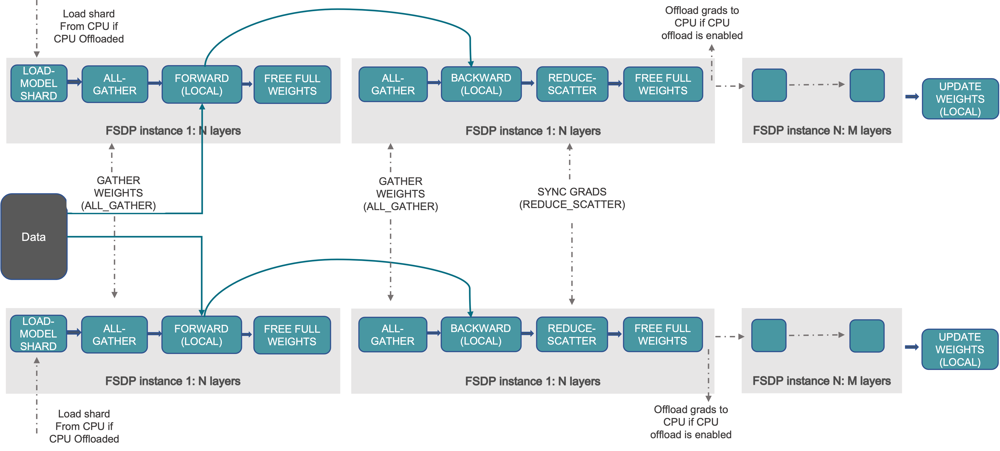
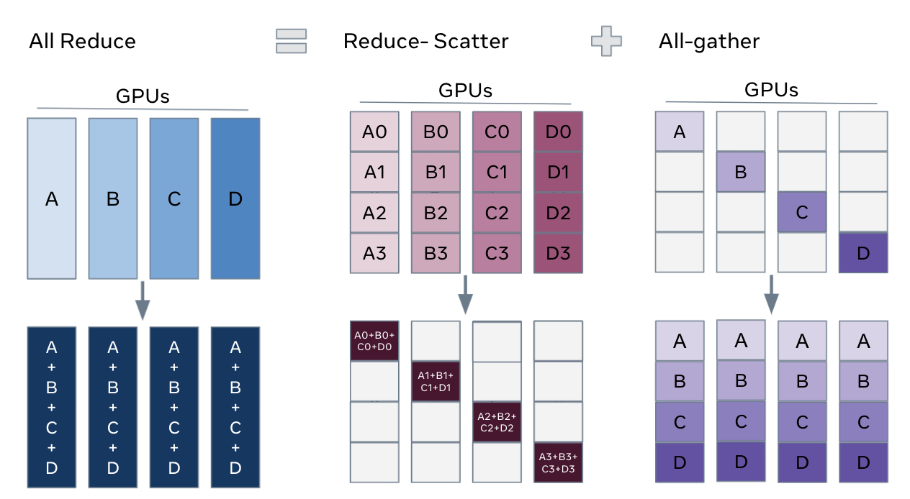
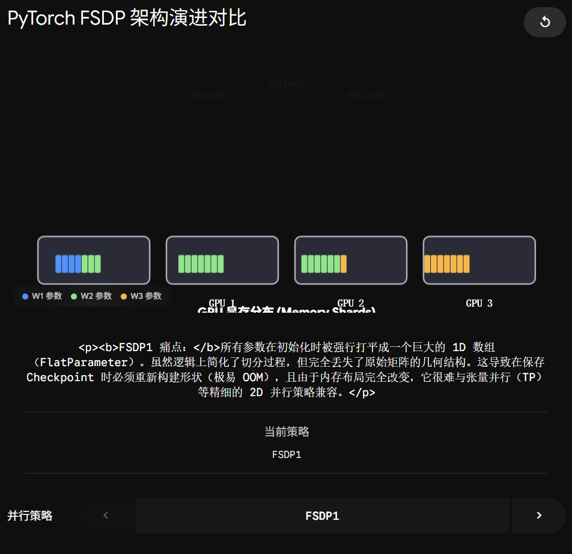
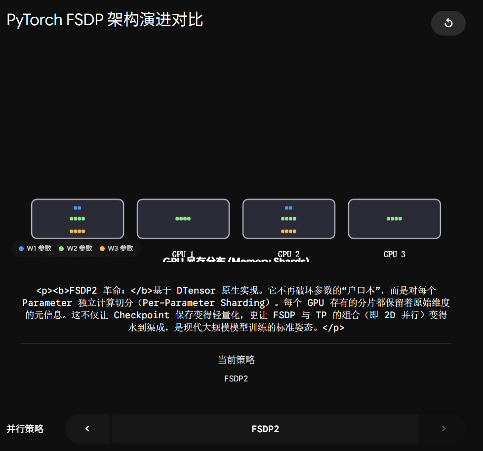

## 官方文档：[torch.distributed.fsdp.fully_shard — PyTorch 2.12 documentation](https://docs.pytorch.org/docs/2.12/distributed.fsdp.fully_shard.html)

你这个问题直接问到了目前 PyTorch 分布式领域的**最前沿、最核心的痛点**！

你不仅追平了工业界的最新进度，而且刚好和你之前学的 `DeviceMesh` 与 `DTensor` 完美闭环。因为 **FSDP2 的灵魂，就是 DTensor。**

要理解 FSDP2 有多牛，我们得先看看上一代（FSDP1）把 SRE 和算法工程师们折磨得有多惨。

### 1\. FSDP1 的痛点：“暴力榨汁机” (FlatParameter)

在 FSDP1 时代，框架为了方便切分数据，采用了一种简单粗暴的做法：**FlatParameter（参数打平）**。

想象你的模型是一个由很多层“千层蛋糕”（不同形状的矩阵张量）组成的精美甜点。FSDP1 怎么切分它呢？

它直接把整个蛋糕扔进榨汁机，打成一锅极其漫长的“1 维糊糊”（1D Array），然后再把这锅糊糊平均分成 8 碗，端给 8 张 GPU。

-   **SRE 灾难现场：** 虽然显存确实省下来了，但因为所有的张量形状（Shape）全被破坏了。当你半夜想要保存一个 Checkpoint（模型快照）时，系统必须把这 8 碗糊糊重新拼起来，再极其艰难地“还原”成千层蛋糕的样子。这个过程经常会导致 CPU 内存瞬间爆满（OOM）直接宕机。

更致命的是，因为它变成了一锅糊糊，你根本无法把它和我们之前聊过的 **TP（张量并行）** 结合起来！

### 2\. FSDP2 的革命：“乐高积木” (基于 DTensor)

PyTorch 官方痛定思痛，在 PyTorch 2.x 推出了完全重写的 FSDP2。它抛弃了“榨汁机”，拿起了我们之前学过的 **DTensor** 武器。

FSDP2 **不再打平任何参数**。它保留每一个矩阵最原始的 2D/3D 形状，然后利用 DTensor 的 `Placement` 策略，极其优雅地对**每一个独立的参数矩阵**进行切分。

为了让你直观感受到这两代架构在显存里到底长什么样，我为你做了一个切分架构模拟器：

### 为什么大厂现在都在狂推 FSDP2？

对于 AI Infra SRE 来说，FSDP2 带来了两大史诗级利好：

1.  **拯救了 Checkpoint（快照保存）：** 因为每个参数的形状都完好无损（只是变成了 DTensor），保存和加载模型时再也不需要那种毁天灭地的“还原”操作了。速度极快，且极其稳定。
2.  **终极 2D/3D 组合魔法（Composability）：** 还记得你们那台 8 卡机器吗？机内跑 TP（张量并行），跨机跑 FSDP（数据并行切分）。在 FSDP1 时代，想把这两者写到一起比登天还难。而在 FSDP2 时代，因为底层都是 DTensor，你只需要像搭积木一样，给 DeviceMesh 传个参数：`Mesh(dim_names=["fsdp", "tp"])`，系统就会自动帮你完成极其复杂的 2D 混合切分！

**TorchTitan** 这个当红炸子鸡之所以能用极少的代码实现极其复杂的千亿模型训练，底层最大的功臣就是 **FSDP2 + DTensor** 的组合。

既然底层理论已经彻底打通，你要不要看看在真正的 PyTorch 代码里，开启 FSDP2 只需要加哪极其精简的几行代码？
