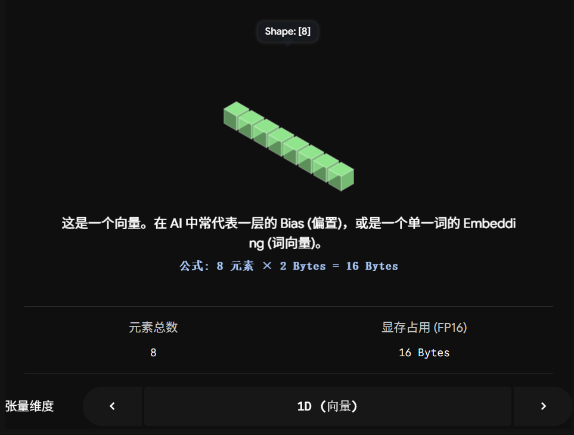
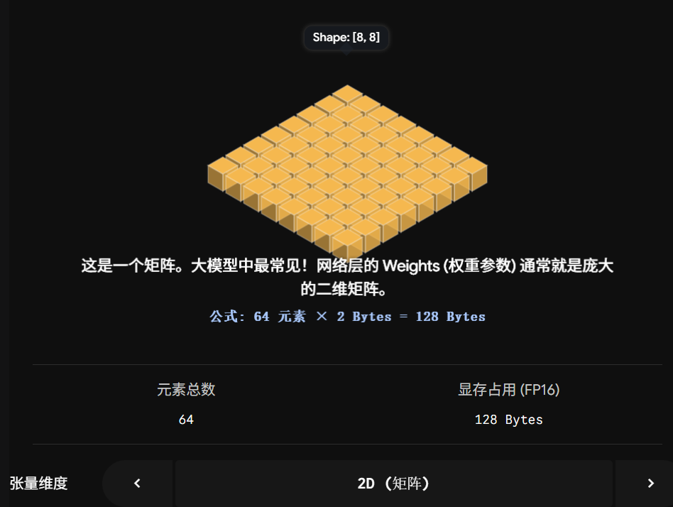
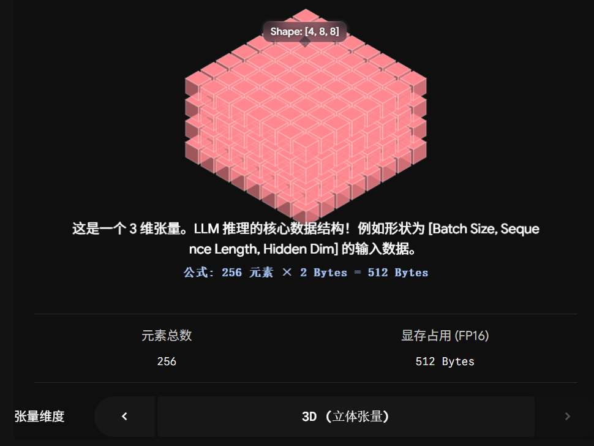

## 什么是Tensor？

简单来说，**Tensor（张量）就是一个多维数组，它是整个深度学习世界里装载数据的“集装箱”。**

无论是你输入的文本、图片，还是模型内部几十亿的参数，在 GPU 眼里，它们全都是 Tensor。

如果脱离数学定义，用最直白的视觉来理解，你可以把它想象成不同维度的魔方：

-   **0维 Tensor (标量 Scalar):** 只有一个数字。例如训练时你盯着看的 `Loss = 0.05`，这就是一个 0 维张量。
-   **1维 Tensor (向量 Vector):** 一排数字。就像编程里的一维数组 `[1.2, 0.5, -0.8]`。
-   **2维 Tensor (矩阵 Matrix):** 一张数字表格。你可以把它想象成一张 Excel 表。大模型里很多线性层（Linear Layer）的权重，本质上就是一张巨大的 2 维 Tensor。
-   **3维 Tensor 及以上:** 多个表格叠在一起组成一个立体“块”。如果是 4 维、5 维，虽然人类在三维空间难以画出来，但在计算机内存里，它们依然是按顺序紧密排列的数字。

为了让你直观感受到这个“集装箱”是如何随着维度膨胀的，我为你做了一个交互式的可视化工具。你可以拖动维度，看看大模型最常见的 3 维张量长什么样，以及它是如何占用你机器上的显存的：

  

### 为什么 AI Infra SRE 必须极其了解 Tensor？

算法工程师看 Tensor，看到的是“特征提取”和“数学变换”。

作为 SRE，你看 Tensor，看到的必须是“显存黑洞”。

这涉及到一个你日常排障时最关键的公式：

**Tensor 的显存占用 = 元素总数 (各维度大小相乘) × 数据类型大小 (dtype)**

1.  **关于 Shape (形状)：**

大模型推理时，输入的 Tensor 形状通常是 3 维的：`**[Batch Size, Sequence Length, Hidden Dimension]**`。

-   **Batch Size (并发请求数):** 并发越高，这个维度越大。
-   **Sequence Length (上下文长度):** 用户输入的 prompt 越长，这个维度越大。
-   *SRE 视角：* 当用户突然发来一篇 10 万字的小说要求总结时，`Sequence Length` 这个维度会瞬间暴涨，整个 3 维 Tensor 的体积呈指数级扩大，然后你的机器就“砰”地一下：`CUDA Out of Memory`。这就要求你配置的系统能自动截断超长文本，或者调整 vLLM 的队列策略。

2.  **关于 Dtype (数据类型)：**

-   以前深度学习常用 **FP32** (单精度浮点数)，每个数字占 **4 个字节**。
-   现在的大模型为了省显存、提速度，统统换成了 **FP16** 或 **BF16** (半精度浮点数)，每个数字占 **2 个字节**。
-   甚至现在最前沿的技术（比如你们可能会用到的量化技术），会把它压缩到 **INT8 (1字节)** 甚至 **INT4 (0.5字节)**。
-   *SRE 视角：* 如果你发现一张 80G 显存的 A800 连一个 70B（700亿参数）的模型都加载不起来，你需要第一时间去查：是不是算法同学启动容器时忘了配量化参数，导致模型默认以 FP32（占用 140GB+ 显存）的格式加载了？

总结一下，Tensor 就是一块“有形状、有格式、需要分配连续显存的数字砖头”。

在你们组现有的集群里，你平时遇到过 `CUDA Out of Memory` 这种报错吗？你一般是怎么处理这种显存溢出问题的？
