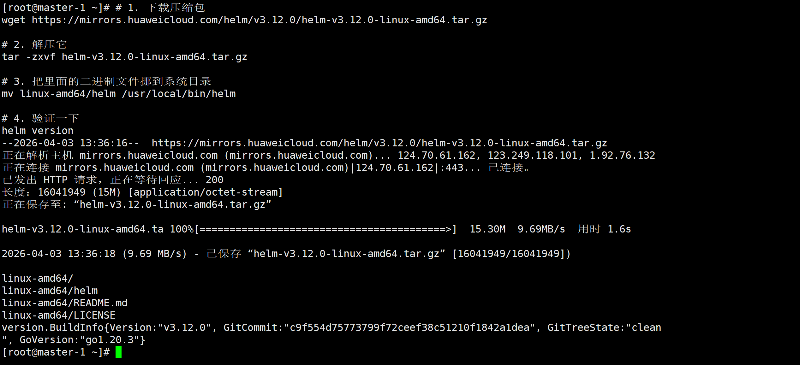

## helm下载

### wget安装

```plain
#wget安装
dnf install wget -y
```

### 手动安装 Helm

```plain
# 1. 下载压缩包
wget https://mirrors.huaweicloud.com/helm/v3.12.0/helm-v3.12.0-linux-amd64.tar.gz

# 2. 解压它
tar -zxvf helm-v3.12.0-linux-amd64.tar.gz

# 3. 把里面的二进制文件挪到系统目录
mv linux-amd64/helm /usr/local/bin/helm

# 4. 验证一下
helm version
```

下载成功



  

  

## 准备Helm基础环境（GitLab下载）

```plain

```
