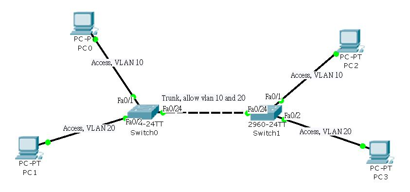

在网络实验和工程中，**Trunk（干道）** 是最基础也最关键的概念之一。

简单来说，如果你有两台交换机，每台交换机上都有 VLAN 10 和 VLAN 20，那么连接这两台交换机的线路就必须配置为 **Trunk**，否则不同交换机上的相同 VLAN 无法通信。



---

### 1\. 为什么要用 Trunk？

如果没有 Trunk，每增加一个 VLAN，你就得在两台交换机之间多拉一根物理网线。

-   **Access 模式：** 一个接口只能属于一个 VLAN（像单行道）。
-   **Trunk 模式：** 一个接口可以承载**多个 VLAN** 的数据（像多车道高速公路）。

Trunk 通过在数据包里打上 **VLAN Tag（标签）** 来区分这个包属于哪个部门，最常用的协议是 **IEEE 802.1Q**。

---

### 2\. Cisco Packet Tracer 中的配置命令

假设你要把交换机的 `FastEthernet 0/24` 端口设为 Trunk：

Bash

```plain
Switch> enable
Switch# configure terminal
Switch(config)# interface f0/24
Switch(config-if)# switchport mode trunk
```

**关键检查命令：**

-   `show interfaces trunk`：查看哪些接口是 Trunk，以及允许通过哪些 VLAN。

---

### 3\. Trunk 的核心参数

-   **Native VLAN（本征 VLAN）：**

-   默认是 **VLAN 1**。
-   Trunk 链路上不打标签的数据包都会被归类到 Native VLAN。
-   **安全建议：** 两端交换机的 Native VLAN 必须一致，否则会报错或产生环路。

-   **Allowed VLAN（允许列表）：**

-   默认 Trunk 允许所有 VLAN 通过。
-   你可以手动限制，比如只允许 VLAN 10： `switchport trunk allowed vlan 10`

---

### 4\. 常见应用场景

1.  **交换机级联：** 连接两台交换机，传输多个 VLAN。
2.  **单臂路由 (Router-on-a-Stick)：** 路由器的一个物理接口连接交换机的 Trunk 口，通过“子接口”实现不同 VLAN 间的通信。

---

### 5\. 快速排错口诀

如果你的网络不通，检查这三点：

1.  **两端模式是否匹配：** 物理链路两头都必须是 `trunk`（或者一头是 `desirable`）。
2.  **VLAN 是否存在：** 交换机里必须先创建了对应的 VLAN，Trunk 才会转发它。
3.  **Native VLAN 是否一致：** 不一致会导致流量错乱。

​  

​  

## trunk的模式

在 Cisco 网络设备中，**Trunk 模式**不仅仅是简单的“开启”或“关闭”，它涉及到一个自动协商协议，叫做 **DTP (Dynamic Trunking Protocol)**。

根据接口对 Trunk 意愿的主动程度，通常分为以下几种模式：

---

### 1\. 常见的四种模式

| **模式 (Mode)** | **描述** | **对端匹配建议** |
| --- | --- | --- |
| **Access** | **强制非 Trunk**。该接口只能属于一个 VLAN，不发送 DTP 帧。 | 连接电脑、服务器。 |
| **Trunk** | **强制 Trunk**。无论对方是谁，我都会把接口变为 Trunk，并试图与对方协商。 | 连接另一台交换机。 |
| **Dynamic Desirable** | **主动协商**。我会主动问对方：“你想变 Trunk 吗？”如果对方是 Trunk 或 Desirable 或 Auto，就变 Trunk。 | 旧版设备默认，现在较少用。 |
| **Dynamic Auto** | **被动协商**。我愿意变 Trunk，但我不主动。如果对方不提要求，我就默认当个 Access 口。 | 现代 Cisco 交换机的默认模式。 |

---

### 2\. 模式组合结果表 (协商结果)

这是网络工程师必须掌握的“对碰”结果：

|  | **Access** | **Trunk** | **Dynamic Desirable** | **Dynamic Auto** |
| --- | --- | --- | --- | --- |
| **Access** | Access | **(冲突报错)** | Access | Access |
| **Trunk** | **(冲突报错)** | **Trunk** | **Trunk** | **Trunk** |
| **Dyn. Desirable** | Access | **Trunk** | **Trunk** | **Trunk** |
| **Dyn. Auto** | Access | **Trunk** | **Trunk** | Access |

**注意：** 如果两端都是 **Dynamic Auto**，结果是 **Access**（因为两个都不主动，没法达成共识）。
