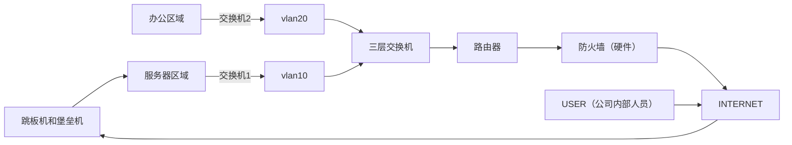

## 跳板机是什么？

**跳板机（Jump Server / Bastion Host）** 是一种专门为了提高网络安全性而设置的特殊服务器。

简单来说，它就像是进入一个封闭社区的“唯一保安亭”。在企业或复杂的网络架构中，为了安全，内部的核心服务器（如数据库、应用服务器）通常不直接暴露在公网上。运维人员如果想管理这些内网机器，必须先登录到这台跳板机，然后再从跳板机“跳”到目标服务器上。

## 跳板机的工作原理

跳板机的核心原理是**物理/逻辑隔离**。它位于公网和内网的交界处，充当一个中间代理的角色。

### 1\. 网络拓扑结构

通常，跳板机会拥有两个网卡：

-   **外网网卡：** 允许特定的远程 IP 通过 SSH 或 RDP 访问。
-   **内网网卡：** 与后端服务器集群相连。

### 2\. 访问流程

典型的操作步骤如下：

1.  **第一步：** 运维人员通过互联网连接到跳板机，并进行身份验证（通常需要多因子认证 MFA）。
2.  **第二步：** 成功进入跳板机后，运维人员在跳板机的终端里发起第二次连接请求（如 `ssh root@internal-ip`）。
3.  **第三步：** 目标服务器验证请求来自受信任的跳板机 IP，允许访问。

### 3\. 核心机制

-   **访问控制（ACL）：** 后端服务器会配置防火墙规则（如 `iptables` 或 `firewalld`），**只允许**来自跳板机 IP 的流量，拒绝所有其他来源。
-   **协议转发：** 跳板机利用 SSH 隧道（SSH Tunneling）或端口转发技术，安全地传递指令。

---

## 为什么需要跳板机？

| **优势** | **说明** |
| --- | --- |
| **收缩攻击面** | 只需要加固一台机器的防御，而不是几十台。 |
| **集中审计** | 所有的操作记录（命令输入、文件上传）都会在跳板机上留痕，方便追溯。 |
| **身份管理** | 无需给每个员工分发所有服务器的密钥，只需管理跳板机的访问权限。 |

---

## 跳板机 vs 堡垒机

虽然这两个词常被混用，但它们在功能深度上有区别：

1.  **跳板机 (Jump Server)：** 侧重于\*\*“连通性”\*\*。它通常只是一个安装了 Linux 系统的服务器，功能较为基础，主要解决“如何安全进入内网”的问题。
2.  **堡垒机 (Bastion Host / PAM)：** 侧重于“管理和审计”。它是跳板机的进化版，具备更强的监控功能，比如：

-   实时屏幕录制。
-   高危命令拦截（例如禁止执行 `rm -rf /`）。
-   自动定期修改后端服务器密码。

**总结：** 跳板机是“路口”，而堡垒机是带有“全方位监控和精细权限控制的安检站”。

##   

  

##
