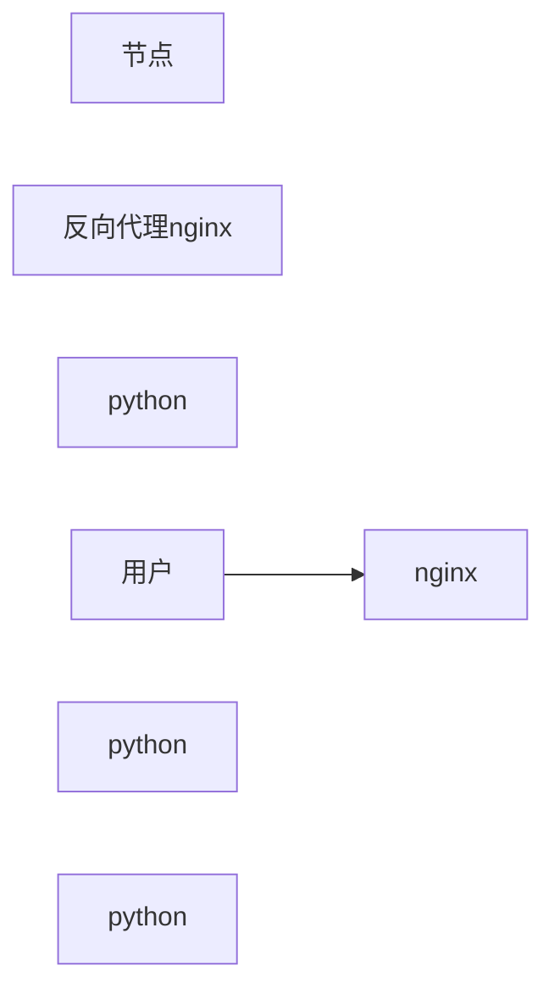

4c

> Apache Kafka（常被称为 "卡夫卡"）是**Apache 软件基金会**的开源分布式流处理平台，最初由 LinkedIn 开发，2011 年捐赠给 Apache 并成为顶级项目，名称取自捷克小说家弗兰兹・卡夫卡（Franz Kafka）。它本质上是一个**分布式、分区化、多副本的日志提交服务**，核心定位是 "高吞吐量的分布式发布 - 订阅消息系统"，同时兼具流处理平台的能力。


  

​  

## 查看网卡信息 ip a

[root@wang ~]# **ip a**  
1: lo: <LOOPBACK,UP,LOWER\_UP> mtu 65536 qdisc noqueue state UNKNOWN group default qlen 1000  
link/loopback 00:00:00:00:00:00 brd 00:00:00:00:00:00  
inet 127.0.0.1/8 scope host lo  
valid\_lft forever preferred\_lft forever  
inet6 ::1/128 scope host noprefixroute  
valid\_lft forever preferred\_lft forever  
2: ens160: <BROADCAST,MULTICAST,UP,LOWER\_UP> mtu 1500 qdisc mq state UP group default qlen 1000  
link/ether 00:0c:29:40:a3:a8 brd ff:ff:ff:ff:ff:ff  
altname enp3s0  
altname enx000c2940a3a8  
inet 192.168.245.130/24 brd 192.168.245.255 scope global dynamic noprefixroute ens160  
valid\_lft 1746sec preferred\_lft 1746sec  
inet6 fe80::20c:29ff:fe40:a3a8/64 scope link noprefixroute  
valid\_lft forever preferred\_lft forever

  

### 1\. `127.0.0.1/8` —— 本地回环地址

-   **所属接口**：`lo`（loopback，回环接口）
-   **核心含义**：这是**本机内部通信的虚拟地址**，不对应任何物理网卡，数据不会经过网线或网卡传输，只在操作系统内核内部流转。
-   **典型用途**

-   测试本地运行的服务（比如你在本机启动了 Spring Boot 项目，用 `127.0.0.1:8080` 就能访问）。
-   进程间通信（本机内的不同程序通过这个地址交互，无需走网络）。
-   验证网络协议栈是否正常（`ping 127.0.0.1` 能通说明 TCP/IP 协议栈没问题）。

-   **补充**：`inet6 ::1/128` 是 IPv6 版本的回环地址，作用和 `127.0.0.1` 一致。

### 2\. `192.168.245.130/24` —— 局域网 IP 地址

-   **所属接口**：`ens160`（物理网卡接口，不同服务器的命名可能不同，比如 `eth0`、`ens33` 等）
-   **核心含义**：这是你的服务器在**局域网内的唯一标识**，由路由器或 DHCP 服务器分配（`dynamic` 表示是动态获取的），用于和局域网内的其他设备（比如同一网段的电脑、服务器）通信。
-   **关键参数说明**

-   `/24`：表示子网掩码是 `255.255.255.0`，这个网段的可用 IP 范围是 `192.168.245.1` ~ `192.168.245.254`。
-   `dynamic`：表示该 IP 是通过 DHCP 动态获取的，重启网卡或设备后可能会变化；如果是 `static` 则是手动配置的固定 IP。

-   **典型用途**

-   局域网内设备互访（比如你用另一台电脑访问这个服务器上的 Kafka 或数据库）。
-   连接外网（通过路由器的 NAT 功能，借助这个 IP 访问互联网）。

### 总结

| IP 地址 | 接口 | 类型 | 作用范围 | 核心用途 |
| --- | --- | --- | --- | --- |
| `127.0.0.1/8` | `lo` | 回环地址 | 本机内部 | 本地服务测试、进程间通信 |
| `192.168.245.130/24` | `ens160` | 局域网地址 | 局域网 + 外网 | 设备间通信、访问互联网 |

  

## DNS （domain name server 域名服务）

**DNS**（Domain Name System，域名系统）是互联网的核心基础设施，**相当于一本巨型的分布式 "电话簿"**，负责将人类易记的域名（如[www.baidu.com](https://www.baidu.com)）转换为计算机可识别的 IP 地址（如 14.215.177.38），使网络通信成为可能。

​  

本地域名解析

1.看缓存

2.看/etc/hosts文件 本地域名映射文件


配置映射实现进程通信

​  

3.请求本地域名解析服务器 /etc/resolv.conf


nameserver ： 声明 DNS 服务器的 IP 地址（最核心），可配置多个（最多 3 个，按优先级生效）

**​**

​  

​  

## 负载均衡

### 1.DNS解析实现负载均衡

DNS 解析实现负载均衡，是一种**基于域名系统的负载分发技术**，核心原理是：**同一个域名对应多个不同的服务器 IP 地址**，DNS 服务器在接收到域名解析请求时，按照预设策略返回不同的 IP，将用户请求均匀分配到多台服务器上，从而实现负载分担、提高服务可用性。

### 2.各种反向代理

一、反向代理的核心概念

反向代理（Reverse Proxy）是 Nginx 最核心的功能之一：简单来说，**客户端不直接访问后端服务器，而是先请求 Nginx 服务器，由 Nginx 代替客户端向后端服务器发起请求，再将后端的响应结果返回给客户端**。

-   **正向代理**：替客户端（用户）向外部服务器请求（比如翻墙工具）；
-   **反向代理**：替后端服务器接收客户端请求（对外只暴露 Nginx 地址，隐藏后端服务）。

### 3.ospf动态路由（根据cost：花费值选择）

**OSPF（开放式最短路径优先）** 是一种基于 **链路状态** 的内部网关协议（IGP），其核心是通过**链路开销（Cost）** 计算最短路径，实现动态路由选择。在搭建跨网段的日志监控系统（如多机房 ELK/Kafka 集群）时，OSPF 可以自动适配网络拓扑变化，保障日志数据传输的稳定性。

### 4.云原生

**云原生（Cloud Native）** 是一套**构建和运行应用的方法论与技术体系**，核心目标是让应用能够充分利用云计算的弹性、可扩展性和分布式特性，实现快速迭代、高效运维和故障自愈。

  
  

​  

基础设置建设

## 中台建设

### 1.DNS管理

**DNS 管理**是指对**域名系统（Domain Name System）** 的各类资源记录、解析策略、服务器配置进行规划、配置、监控和维护的一系列操作，核心目标是保障域名到 IP 地址解析的**准确性、稳定性和高效性**。

简单来说，DNS 管理就是让用户输入域名（如 `kibana.example.com`）时，能快速、正确地找到对应的服务器 IP，同时满足业务的负载均衡、容灾、安全等需求。

### 2.配置管理

### 3.流量切换

在 Kafka 中，**流量切换** 是指将生产者 / 消费者的请求流量，从某一组 Broker、分区或 Topic，转移到其他目标节点的运维操作，核心目标是 **保障服务高可用、实现负载均衡、完成集群扩缩容或故障迁移**。

### 4.CI/CD

**CI/CD** 是 **持续集成（Continuous Integration）** 和 **持续部署 / 交付（Continuous Deployment/Delivery）** 的合称，是一套**自动化软件构建、测试、部署的流程体系**，核心目标是**缩短从代码提交到应用上线的周期**，降低人工操作成本和出错概率，同时提升迭代效率。

在你搭建的日志监控系统（ELK + Kafka + Filebeat + Python 消费端）中，CI/CD 可以自动化完成**代码编译、镜像构建、配置更新、服务部署**等工作，比如 Python 消费脚本的更新、Filebeat 配置的下发、Kibana 可视化面板的同步等。

### 5.日志管理

**日志管理**是一套围绕**日志的采集、传输、存储、解析、检索、分析、可视化及归档清理**的全生命周期管理体系，核心目标是**保障日志数据的完整性、可用性和安全性**，同时通过日志挖掘系统运行状态、定位故障、审计合规、优化业务。

​  

​  

## 灰度

在云原生和软件发布领域，**灰度**通常指 **灰度发布**（也叫金丝雀发布），是一种**平滑过渡的版本迭代策略**，核心目标是**降低新版本上线的风险**，避免全量发布时因潜在 bug 导致大规模服务故障。

简单来说，灰度发布不是一次性把所有用户流量切换到新版本，而是**分批次、分范围**地将流量导入新版本，验证没问题后再逐步扩大覆盖比例，最终实现全量切换。

​  

​  

# 日志收集平台

日志

1.错误定位，追责

2.用户行为分析

​  




![XE\]8\]~3`RVAPV3H\]{N17@SQ.jpg](https://cdn.nlark.com/yuque/0/2026/jpeg/62301513/1768206496384-714b60be-8753-417a-9347-add4ab7765b9.jpeg)

![U\]NR{)O@L1UT3X$E[E$`(W9.jpg](https://cdn.nlark.com/yuque/0/2026/jpeg/62301513/1768206511355-abe64513-b838-493f-a2c5-0e3cc3c22659.jpeg)

  

### 元数据

元数据 (Metadata) 最本质的定义是 \*\*"描述数据的数据"(Data about Data)\*\*，又称中介数据、中继数据。它不包含数据本身的内容（如照片的像素、文档的文字），而是提供关于数据的属性、上下文、结构和管理规则等信息，帮助人们理解、查找、组织和使用数据。

​  

## Kafka KRaft 元数据管理全解析

**核心结论**：KRaft (Kafka Raft) 通过内置的**Raft 共识协议**与**\_\_cluster\_metadata 内部主题**实现元数据自主管理，移除对 ZooKeeper 的依赖，形成 \*\* 控制器集群 (Controller Quorum)+ 工作节点 (Broker)\*\* 的双层架构，确保元数据的一致性、可用性与高效更新。

---

## 一、KRaft 元数据管理的核心架构

### 1\. 架构转型：从 ZK + 单控制器到 Raft 控制器集群

| **维度** | **ZK 模式** | **KRaft 模式** |
| --- | --- | --- |
| 元数据存储 | 外部 ZooKeeper 的 ZNode 树 | 内置__cluster_metadata 单分区主题 |
| 控制器 | 单个选举产生的 Controller Broker | 3-5 节点的 Controller Quorum (控制器集群)，通过 Raft 选举 Leader |
| 一致性保障 | ZK 的 ZAB 协议 | KRaft (Raft 协议)，多数派确认机制 |
| 故障恢复 | 分钟级 (依赖 ZK) | 秒级 (基于快照与日志) |
| 扩展性 | 受 ZK 性能限制 | 随 Kafka 集群线性扩展 |

### 2\. 核心组件分工

-   **Active Controller (主控制器)**：Raft 集群 Leader，唯一处理元数据变更请求，负责写入\_\_cluster\_metadata 日志
-   **Follower Controllers (从控制器)**：同步元数据日志，参与 Leader 选举，主控制器故障时自动接管
-   **Brokers (工作节点)**：作为元数据日志的 Follower，定期拉取更新，维护本地元数据缓存，处理客户端请求

  

  

消息通信机制

1.点对点

2.发布 - 订阅模式 --Kafka

1.kafka相关概念

broker： 集群节点

producer： 生产者

consumer： 消费者

topic： 不同数据，不同topic，消息分布

partition： 分区

replication： 副本

ISR： 副本同步队列

​  

一般有几个节点，设置几个分区

分区可以提高吞吐量

多分区无法保证消息的顺序性

单分区内消息是顺序的

​  

## 二、Kafka 消息存储机制：基于分区日志的高效设计

Kafka 的高性能核心源于其**日志式存储**和**分区并行**的设计，具体机制如下：

1.  **Partition 日志结构**每个 Partition 对应磁盘上的一个目录，目录名格式为 `{topic}-{partition id}`。目录内的消息被拆分为多个**日志分段（Log Segment）** 文件，每个 Segment 由两类文件组成：

-   `.log` 文件：存储实际的消息数据
-   `.index` 文件：消息 offset 与物理存储位置的索引，用于快速查询

2.  **顺序读写 + 零拷贝技术**

-   Kafka 利用磁盘**顺序写**的特性（顺序写性能远高于随机写），消息追加到 Partition 尾部，避免磁盘寻址开销。
-   采用 **零拷贝（Zero-Copy）** 技术，直接将数据从内核缓冲区传输到网卡缓冲区，跳过用户态拷贝，大幅提升消息传输效率。

3.  **offset 与消息持久化**

-   每个消息在 Partition 内有唯一的 `offset`，offset 是一个逻辑递增的整数，仅表示消息在 Partition 内的顺序。
-   消息默认持久化到磁盘，支持配置**保留时间**或**存储大小**，过期数据自动清理。

## 三、Kafka 生产 - 消费核心流程

### 1\. 生产者发送消息流程

1.  生产者向 Kafka 发送消息时，首先通过**分区策略**确定消息要写入的 Partition：

-   轮询策略（默认）：消息均匀分配到所有 Partition
-   Key 哈希策略：相同 Key 的消息写入同一个 Partition，保证消息有序
-   自定义策略：用户根据业务规则指定 Partition

2.  生产者向目标 Partition 的 **Leader 副本**发送消息，同时可通过 `acks` 参数控制消息可靠性：

-   `acks=0`：生产者发送后无需等待 Broker 确认，性能最高，可能丢消息
-   `acks=1`：Leader 副本写入成功后即返回确认，Leader 故障可能丢消息
-   `acks=-1/all`：ISR 列表中所有副本写入成功后才返回确认，可靠性最高

3.  Leader 副本将消息写入本地日志，Follower 副本主动拉取 Leader 的日志进行同步。
4.  当 ISR 内所有副本同步完成后，Leader 标记消息为**已提交**，并向生产者返回成功响应。

### 2\. 消费者消费消息流程

1.  消费组内的 Consumer 向 Controller 请求获取 Topic 的 Partition 分配方案。
2.  Controller 根据**分区分配策略**（如 Range、RoundRobin），将不同 Partition 分配给消费组内的不同 Consumer。
3.  Consumer 向分配到的 Partition 的 Leader 副本发起拉取请求，指定要消费的起始 offset。
4.  Leader 副本根据 offset 和索引文件，快速定位消息并返回给 Consumer。
5.  Consumer 消费完成后，主动提交 offset（可配置自动提交或手动提交），记录消费进度，避免重复消费。

## 四、Kafka 高可用保障机制

Kafka 集群的高可用核心是 **副本机制 + 控制器故障转移**，确保 Broker 或 Leader 副本故障时，服务不中断：

1.  **Leader 副本选举**

-   当 Topic 创建或 Broker 故障时，Controller 负责为每个 Partition 选举 Leader 副本。
-   选举规则：优先从 ISR 列表中选择副本作为 Leader，保证数据一致性。

2.  **Broker 故障转移流程**

-   若某个 Broker 宕机，该 Broker 上的所有 Leader 副本都会下线。
-   Controller 检测到 Broker 故障后，立即为这些 Partition 重新选举 Leader（从 ISR 中选）。
-   新 Leader 上线后，生产者和消费者自动切换到新 Leader，集群恢复正常服务。

3.  **KRaft 模式 vs ZK 模式的高可用差异**

-   **ZK 模式**：依赖 ZooKeeper 存储元数据、选举 Controller，Controller 为单节点，故障后需重新选举。
-   **KRaft 模式**：内置 Raft 协议，采用 Controller Quorum（3-5 节点），Leader 故障时秒级切换，元数据存储在内部主题 `__cluster_metadata`，可靠性更高。

## 五、Kafka 集群核心特性

1.  **高吞吐**：分区并行 + 顺序写 + 零拷贝，支持每秒百万级消息处理。
2.  **高可用**：多副本 + 故障自动转移，集群节点故障不影响服务。
3.  **可扩展**：支持动态添加 Broker，Partition 可重新分配，集群规模线性扩展。
4.  **消息持久化**：消息落地磁盘，支持长期存储与回溯消费。
5.  **低延迟**：批量发送 + 零拷贝技术，端到端延迟可低至毫秒级。

​  

​  

## 卡夫卡流量日志监控平台

### 一、项目配置和准备

#### 将linux主机ip修改为静态ip

在搭建日志监控系统（ELK、Kafka、Filebeat 等）这类服务时，将 Linux 主机 IP 修改为**静态 IP** 是保障服务稳定运行的核心配置，核心原因是 **避免 IP 动态变化导致服务链路中断、配置失效和运维成本剧增**。

​  

#### 下载依赖软件

dnf install wget vim java-21-openjdk.x86\_64 -y

​  

##### 查看ip和网卡型号便于修改ip配置文件（网卡型号可能是ens33或ens160，这里以ens33为例）

ip add


​  

##### 查看本地域名解析地址，将虚拟机ip和nameserver写入/etc/NetworkManager/system-connections/ens33.nmconnection下的addressesl，DNS设置为默认的114.114.114.114。

vim /etc/resolv.conf


  

##### 修改linux下的配置文件

vim /etc/NetworkManager/system-connections/ens33.nmconnection


##### 修改后重新加载配置

nmcli c reload #重新加载配置

##### 如果出现断连，进入vm中在虚拟机中输入以下代码重新启动虚拟机网卡

#如果断连了

nmcli d status

nmcli d up ens33

​  

##### 修改主机名，方便在后续操作中用主机名进行通讯（避免直接写ip）

hostnamectl set-hostname kafka1

##### 修改/etc/hosts文件，添加主机名和ip地址映射

vim /etc/hosts

修改 Linux 系统的 `/etc/hosts` 文件，添加 **IP 地址与主机名的映射关系**，核心目的是 **绕过 DNS 解析、实现快速的主机名寻址**，同时保障服务访问的稳定性、安全性和运维效率。


  

### 如果windows需要连接kafka集群也需要修改hosts的ip地址映射

​  

window连接需要在本地修改 C:\\Windows\\System32\\drivers\\etc\\hosts 文件添加映射（需要管理员权限）

​  

##### 关闭每一台机器的selinux与防火墙

###### 关闭防火墙：

iptables -F #清空防火墙规则

systemctl stop firewalld #关闭防火墙服务

systemctl disable firewalld #设置开机不自启

​  

###### 关闭selinux，编辑/etc/selinux/config 文件

​  

SELINUX=disabled

重启系统：

reboot

​  

### 二、部署kafka集群

#### 下载kafka将kafka压缩包放在opt目录下

cd /opt

wget [https://archive.apache.org/dist/kafka/3.6.1/kafka\_2.13-3.6.1.tgz](https://archive.apache.org/dist/kafka/3.6.1/kafka_2.13-3.6.1.tgz)

​  

解压缩

tar xf kafka\_2.13-3.6.1.tgz

cd kafka\_2.13-3.6.1

​  

#### 修改kafka的配置文件位于kafka目录下config/kraft/server.properties

vim /opt/kafka\_2.13-3.6.1/config/kraft


#### 修改配置文件,位于kafka目录下config/kraft/server.properties

```plain
#修改节点id，每个节点唯一
node.id=1

#修改控制器投票列表
controller.quorum.voters=1@192.168.223.161:9093,2@192.168.223.162:9093,3@192.168.223.163:9093

#修改监听器和控制器，绑定ip。其中kafka1为主机名，可用本机ip地址代替
listeners=PLAINTEXT://kafka1:9092,CONTROLLER://kafka1:9093

# 侦听器名称、主机名和代理将向客户端公布的端口.(broker 对外暴露的地址)
# 如果未设置，则使用"listeners"的值.
advertised.listeners=PLAINTEXT://kafka1:9092
```

-   *配置文件详解*

```plain
############################# Server Basics #############################

# 此服务器的角色。设置此项将进入KRaft模式(controller 相当于主机、broker 节点相当于从机,主机类似 zk 功能)
process.roles=broker,controller

# 节点 ID
node.id=2

# 全 Controller 列表
controller.quorum.voters=2@192.168.58.130:9093,3@192.168.58.131:9093,4@192.168.58.132:9093

############################# Socket Server Settings #############################

# 套接字服务器侦听的地址.
# 组合节点（即具有`process.roles=broker,controller`的节点）必须至少在此处列出控制器侦听器
# 如果没有定义代理侦听器，那么默认侦听器将使用一个等于java.net.InetAddress.getCanonicalHostName()值的主机名,
# 带有PLAINTEXT侦听器名称和端口9092
#   FORMAT:
#     listeners = listener_name://host_name:port
#   EXAMPLE:
#     listeners = PLAINTEXT://your.host.name:9092
#不同服务器绑定的端口
listeners=PLAINTEXT://192.168.58.130:9092,CONTROLLER://192.168.58.130:9093

# 用于代理之间通信的侦听器的名称(broker 服务协议别名)
inter.broker.listener.name=PLAINTEXT

# 侦听器名称、主机名和代理将向客户端公布的端口.(broker 对外暴露的地址)
# 如果未设置，则使用"listeners"的值.
advertised.listeners=PLAINTEXT://192.168.58.130:9092

# controller 服务协议别名
# 控制器使用的侦听器名称的逗号分隔列表
# 如果`listener.security.protocol.map`中未设置显式映射，则默认使用PLAINTEXT协议
# 如果在KRaft模式下运行，这是必需的。
controller.listener.names=CONTROLLER

# 将侦听器名称映射到安全协议，默认情况下它们是相同的。(协议别名到安全协议的映射)有关更多详细信息，请参阅配置文档.
listener.security.protocol.map=CONTROLLER:PLAINTEXT,PLAINTEXT:PLAINTEXT,SSL:SSL,SASL_PLAINTEXT:SASL_PLAINTEXT,SASL_SSL:SASL_SSL

# 服务器用于从网络接收请求并向网络发送响应的线程数
num.network.threads=3

# 服务器用于处理请求的线程数，其中可能包括磁盘I/O
num.io.threads=8

# 套接字服务器使用的发送缓冲区（SO_SNDBUF）
socket.send.buffer.bytes=102400

# 套接字服务器使用的接收缓冲区（SO_RCVBUF）
socket.receive.buffer.bytes=102400

# 套接字服务器将接受的请求的最大大小（防止OOM）
socket.request.max.bytes=104857600

############################# Log Basics #############################

# 存储日志文件的目录的逗号分隔列表(kafka 数据存储目录)
log.dirs=/usr/kafka/kafka_2.13-3.6.1/datas

# 每个主题的默认日志分区数。更多的分区允许更大的并行性以供使用，但这也会导致代理之间有更多的文件。
num.partitions=1

# 启动时用于日志恢复和关闭时用于刷新的每个数据目录的线程数。
# 对于数据目录位于RAID阵列中的安装，建议增加此值。
num.recovery.threads.per.data.dir=1

############################# Internal Topic Settings  #############################
# 组元数据内部主题"__consumer_offsets"和"__transaction_state"的复制因子
# 对于除开发测试以外的任何测试，建议使用大于1的值来确保可用性，例如3.
offsets.topic.replication.factor=1
transaction.state.log.replication.factor=1
transaction.state.log.min.isr=1

############################# Log Flush Policy #############################

# 消息会立即写入文件系统，但默认情况下，我们只使用fsync()进行同步
# 操作系统缓存延迟。以下配置控制将数据刷新到磁盘.
# 这里有一些重要的权衡:
#    1. Durability(持久性): 如果不使用复制，未清理的数据可能会丢失
#    2. Latency(延迟): 当刷新发生时，非常大的刷新间隔可能会导致延迟峰值，因为将有大量数据要刷新.
#    3. Throughput(吞吐量): 刷新通常是最昂贵的操作，较小的刷新间隔可能导致过多的寻道.
# 下面的设置允许配置刷新策略，以便在一段时间后或每N条消息（或两者兼有）刷新数据。这可以全局完成，并在每个主题的基础上覆盖

# 强制将数据刷新到磁盘之前要接受的消息数
#log.flush.interval.messages=10000

# 在我们强制刷新之前，消息可以在日志中停留的最长时间
#log.flush.interval.ms=1000

############################# Log Retention Policy #############################

# 以下配置控制日志段的处理。可以将该策略设置为在一段时间后删除分段，或者在累积了给定大小之后删除分段。
# 只要满足这些条件中的任意一个，segment就会被删除。删除总是从日志的末尾开始

# 日志文件因使用年限而有资格删除的最短使用年限
log.retention.hours=168

# 基于大小的日志保留策略。除非剩余的段低于log.retention.bytes，否则将从日志中删除段。独立于log.retention.hours的函数。
#log.retention.bytes=1073741824

# 日志segment文件的最大大小。当达到此大小时，将创建一个新的日志segment
log.segment.bytes=1073741824

# 检查日志segments以查看是否可以根据保留策略删除它们的间隔
log.retention.check.interval.ms=300000
```

​  

#### 创建kafka集群

cd /opt/kafka\_2.13-3.6.1

\# 在其中一台执行，生成集群UUID命令，拿到集群UUID保存在当前tmp\_random文件中

bin/kafka-storage.sh random-uuid >tmp\_random

\# 查看uuid

[root@chainmaker1 kafka\_2.13-3.6.1]# cat tmp\_random

z3oq9M4IQguOBm2rt1ovmQ

\# 在所有机器上执行，它会初始化存储区域，为 Kafka 集群的元数据存储和后续操作做好准备。z3oq9M4IQguOBm2rt1ovmQ为自己生成的集群uuid

bin/kafka-storage.sh format -t z3oq9M4IQguOBm2rt1ovmQ -c /opt/kafka\_2.13-3.6.1/config/kraft/server.properties

​  

#### 启动kafka

###### 命令行启动

启动：

bin/kafka-server-start.sh -daemon /opt/kafka\_2.13-3.6.1/config/kraft/server.properties

关闭：

bin/kafka-server-stop.sh

  

###### 使用systemctl管理服务 -- systemd

编辑文件 /usr/lib/systemd/system/kafka.service

```plain
[Unit]
Description=Apache Kafka server (KRaft mode)
Documentation=http://kafka.apache.org/documentation.html
After=network.target
[Service]
Type=forking
User=root
Group=root
Environment="PATH=/usr/local/sbin:/usr/local/bin:/usr/sbin:/usr/bin:/root/bin:/usr/lib/jvm/java-11-openjdk-11.0.23.0.9-2.el7_9.x86_64/bin/"
ExecStart=/opt/kafka_2.13-3.6.1/bin/kafka-server-start.sh -daemon /opt/kafka_2.13-3.6.1/config/kraft/server.properties
ExecStop=/opt/kafka_2.13-3.6.1/bin/kafka-server-stop.sh
Restart=on-failure
[Install]
WantedBy=multi-user.target
```

  

重新加载systemd配置

systemctl daemon-reload

​  

启动kafka服务

systemctl start kafka

​  

关闭kafka服务

systemctl stop kafka

​  

设置开机自启

systemctl enable kafka

​  

查看kafka状态

systemctl status kafka


  

#### 测试集群

\# 创建topic

​bin/kafka-topics.sh --create --bootstrap-server kafka3:9092 --replication-factor 3 --partitions 3 --topic my\_topic

\*\* --replication-factor指定副本因子，--partitions指定分区数，--topic指定主题名称。

\# 查看topic

bin/kafka-topics.sh --list --bootstrap-server kafka3:9092

#创建生产者，发送消息，测试用（在不同虚拟机上测试）

bin/kafka-console-producer.sh --broker-list kafka3:9092 --topic my\_topic

#创建消费者，获取数据，测试用（在不同虚拟机上测试）

bin/kafka-console-consumer.sh --bootstrap-server kafka1:9092 --topic my\_topic --from-beginning

​  

### 三、部署filebeat

**Filebeat** 是 Elastic 公司推出的一款**轻量级、开源的日志采集器**，专为在服务器上高效收集、转发日志数据而设计，是 ELK（Elasticsearch、Logstash、Kibana）技术栈中负责**日志采集环节**的核心组件，也是你搭建的日志监控系统里的**数据入口**。

​  

​  

​  

​  

### Celery部署

#### celery下载

cd /opt

mkdir monitor/celery\_app -p

​  

#### 编辑配置文件 config.py

from celery.schedules import crontab  
BROKER\_URL = 'redis://192.168.20.161:6379/0' # Broker配置，使用Redis作为消息中间件  
CELERY\_RESULT\_BACKEND = 'redis://192.168.20.161:6379/1' # BACKEND配置，这里使用redis  
CELERY\_RESULT\_SERIALIZER = 'json' # 结果序列化方案  
CELERY\_TASK\_RESULT\_EXPIRES = 60 \* 60 \* 24 # 任务过期时间  
CELERY\_TIMEZONE='Asia/Shanghai' # 时区配置  
CELERY\_IMPORTS = ( # 指定导入的任务模块,可以指定多个  
'celery\_app.task',  
)

CELERYBEAT\_SCHEDULE = {  
'celery\_app.task.test': {  
'task': 'celery\_app.task.test',  
'schedule': crontab(minute='\*/1'),  
'args': (-3, 10)  
}  
}

#### 2、编辑\_\_init\_\_.py (双下划线开头，双下划线结尾)  
from celery import Celery  
app = Celery('task')  
app.config\_from\_object('celery\_app.config')

#### 3、编辑task.py  
from . import app

@app.task  
def test(a,b):  
print("task test start ...")  
result = abs(a) + abs(b)  
print("task test end....")  
return result

​  

```plain

* celery 启动beat (在monitor目录下执行)

```

celery -A celery\_app beat

```plain

* celery 启动worker

```

celery -A celery\_app worker -l info -c 4

启动

```plain
# 进入项目根目录
cd /opt/monitor

# 安装依赖（首次执行）
pip3 install pymysql sqlalchemy celery redis -i https://mirrors.tuna.tsinghua.edu.cn/pypi/web/simple

# 杀死旧的Celery进程（避免冲突）
ps -ef | grep celery | grep -v grep | awk '{print $2}' | xargs kill -9 2>/dev/null

# 启动Celery Beat（调度器）
nohup celery -A celery_app beat > celery_beat.log 2>&1 &

# 启动Celery Worker（执行器）
nohup celery -A celery_app worker --loglevel=info > celery_worker.log 2>&1 &

# 查看进程是否正常运行
ps -ef | grep celery
```

​  

### redis部署

#### redis安装

yum install -y epel-release

  
dnf install -y epel-release

​  

dnf install -y https://rpms.remirepo.net/enterprise/remi-release-10.rpm

​  

dnf module enable -y redis:remi-7.2  

dnf install -y redis  

​  

#### redis-cli连接数据库

​  

##### 关闭数据库保护模式

临时关闭

执行命令关闭保护模式

CONFIG SET protected-mode no

​  

验证是否关闭成功（返回no则正确）

CONFIG GET protected-mode

​  

##### 永久关闭

编辑Redis配置文件（老版本在/etc/redis.conf ）

vim /etc/redis/redis.conf

​  

找到以下配置行，修改为no

protected-mode no


​  

保存后重启Redis服务

systemctl restart redis  

​  

同时修改

bind 0.0.0.0 #监听本机任意ip


​  

### nginx部署

\* 安装nginx

  

dnf install nginx -y

编辑配置文件 /etc/nginx/conf.d/sc.conf

```plain
upstream flask {
     server 192.168.20.162:5000;
     server 192.168.20.163:5000;
  
  }
  
  server {
      server_name www.sc.com;
      location / {
         proxy_pass http://flask;
      }
  
  }
```

启动nginx

systemctl start nginx

  

## ELK近实时日志分析

elaticsearch

Elasticsearch（简称 ES）是一款 **分布式、RESTful 风格的开源搜索引擎**，基于 Lucene 底层构建，核心定位是 **“快速检索、分析海量数据”**，支持结构化 / 非结构化数据（日志、文本、JSON 等）的实时查询、聚合分析，广泛用于日志检索、全文搜索、监控告警、数据分析等场景。

​  

### Elasticsearch（ES）速度远快于Mysql的原因

Elasticsearch（ES）速度远超MySQL的核心原因，本质是**两者的设计目标和底层架构完全不同**：MySQL是为「事务性数据存储+精准查询」设计的关系型数据库，而ES是为「海量非结构化/半结构化数据的全文检索+聚合分析」设计的分布式搜索引擎，从底层原理到查询逻辑都做了极致的性能优化。

#### 一、核心设计目标差异（根源）

| Elasticsearch | MySQL |
| --- | --- |
| 目标是「快速检索/聚合海量数据」，牺牲部分写入性能、事务性，换取查询速度 | 目标是「安全存储/精准读写事务性数据」，优先保证ACID、数据一致性，查询性能是次要优化方向 |
| 典型场景：日志检索、全文搜索、实时监控、大数据分析（千万/亿级数据） | 典型场景：业务系统数据存储、订单/用户管理、精准条件查询（百万级数据） |

#### 二、ES速度快的核心技术原因（逐条拆解）

##### 1\. 倒排索引（最核心！）—— 检索的“专属优化”

这是ES远超MySQL的**根本原因**，MySQL的B+树索引在全文检索/模糊查询场景下完全无法匹敌：

-   **MySQL的B+树索引**：  
    为「行记录的精准查找」设计（如`where id=123`/`where user_id>1000`），本质是“按字段值找行”。  
    若做模糊查询（如`where content like '%关键词%'`），会直接失效，触发全表扫描，速度极慢。
-   **ES的倒排索引**：  
    为「全文检索」设计，提前将文本内容拆分为“词条（Term）”，建立“词条→文档ID”的映射表（类似字典的索引）。  
    比如文本“Nginx监控日志”拆分为`nginx`/`监控`/`日志`，查询“监控”时，直接通过词条找到所有包含该词的文档，无需扫描全量数据。

##### 2\. 分布式架构—— 并行处理海量数据

-   **MySQL**：  
    单机为主，虽支持主从/分库分表，但分表逻辑需业务层实现，查询时无法自动并行计算，单机性能瓶颈明显（百万级以上数据查询变慢）。
-   **ES**：  
    天生分布式，数据会自动分片（Shard）存储在多个节点，查询时**多节点并行检索+结果聚合**，相当于“多个人同时找东西，最后汇总结果”，海量数据下性能线性提升。

##### 3\. 内存优先的存储模型—— 减少磁盘IO

-   **MySQL**：  
    数据默认存储在磁盘，虽有Buffer Pool缓存热点数据，但缓存策略为“按需缓存”，且受限于事务/锁机制，无法全部依赖内存。
-   **ES**：  
    核心数据（倒排索引、文档数据）优先加载到内存，查询时几乎全内存操作（磁盘仅作持久化），而内存IO速度是磁盘的千倍以上。  
    同时ES的Lucene底层做了内存对齐、数据压缩等优化，进一步提升内存利用率。

##### 4\. 无事务/锁的轻量化设计—— 减少查询开销

-   **MySQL**：  
    为保证ACID，查询时需处理行锁/表锁、事务隔离级别、MVCC等，这些机制会带来大量性能开销（即使是读操作）。
-   **ES**：  
    不支持复杂事务（仅支持简单的文档级原子性），无锁设计，查询时无需处理锁竞争、事务回滚等逻辑，请求处理链路极短。

##### 5\. 列式存储+预聚合—— 聚合查询更快

-   **MySQL**：  
    采用行式存储（一行数据的所有字段存在一起），做聚合查询（如`sum(traffic)`/`group by ip`）时，需扫描所有行的指定字段，效率低。
-   **ES**：  
    支持列式存储（同一字段的所有值存在一起），且可提前构建聚合桶（Bucket），聚合查询时直接读取预计算结果，无需全量扫描。

##### 6\. 分词/过滤的提前处理—— 减少查询时计算

-   ES在写入数据时，会提前完成：分词、大小写转换、停用词过滤（如“的/地/得”）、字段类型转换等；
-   MySQL在查询时才会处理这些逻辑（如`lower(content)`/`substr(content)`），查询时额外增加计算开销。

#### 三、关键对比：同场景下的性能差异

假设查询“过去1小时内包含‘error’的Nginx日志，按IP分组统计请求数”（数据量1000万条）：

-   **MySQL**：  
    需要执行`select ip, count(*) from nginx_log where content like '%error%' and time > xxx group by ip`，触发全表扫描+文件排序，耗时可能**几十秒甚至分钟级**；
-   **ES**：  
    通过倒排索引快速找到含“error”的文档，分布式并行聚合IP维度的请求数，耗时**毫秒到秒级**。

#### 四、注意：ES不是“万能快”

ES的快是“场景化的快”，在以下场景不如MySQL：

1.  精准的行级更新/删除（ES更新文档需重建索引，MySQL直接更新行）；
2.  强事务性操作（如金融交易，MySQL的ACID更可靠）；
3.  小数据量的简单查询（百万级以内，MySQL的B+树索引足够快，ES的分布式开销反而可能更高）。
4.  存储大文件

### 总结

ES速度远超MySQL的核心原因可归纳为3点：

1.  **索引层面**：倒排索引专为检索设计，秒杀MySQL的B+树索引（尤其全文/模糊查询）；
2.  **架构层面**：分布式并行处理，突破单机性能瓶颈；
3.  **存储/计算层面**：内存优先+无事务开销+预处理，减少查询时的IO和计算成本。

简单说：**MySQL是“精准保管数据的仓库管理员”，ES是“快速找东西的搜索专家”**，两者定位不同，导致检索性能天差地别。在你的监控场景中，若需检索海量日志、做实时聚合分析，用ES替代MySQL会带来数量级的性能提升。

​  

elasticsearch选举


​  

​  

kibana

​  

​  

​  

​  

​  

​  

## 项目总结


为了监测网站访问状况，对网站日志进行分析，流量监控，我基于kafka搭建了一个日志收集平台，收集nginx反向代理集群的access日志，再进行可视化分析和流量预警，具体操作步骤，我搭建了一个3节点，3分区，3副本的kafka集群和nginx反向代理集群，通过filebeat对nginx上的access.log日志收集，用Kafka作为中间件接收这些日志数据，再通过python脚本消费kafka的储存的数据并进行数据清理选取一些的字段存储在mysql数据库中，用celery的定时任务从mysql中读取数据，实现流量预警功能（超出范围发送邮件告警）和ELK实现对日志数据的可视化分析，其中Elasticsearch用来快速检索，Kibana 将 Elasticsearch 的数据进行可视化管理。
