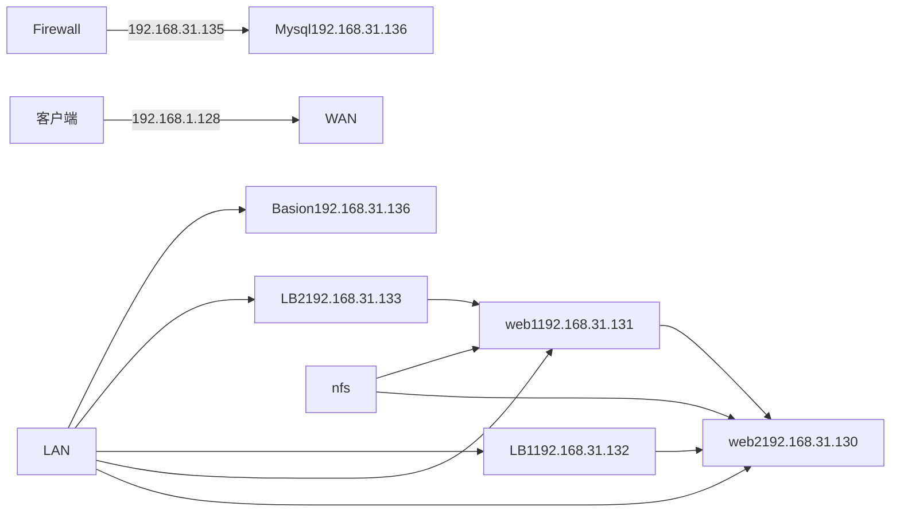

这个项目的核心是**基于 rocky10.1 搭建高可用、可监控、安全可控的 Web 集群系统**，通过整合多种运维工具和服务，实现 Web 服务的稳定部署、高效管理与安全防护。

​  

### 核心模块与目标

1.  **Web 集群架构**：以 web1、web2 为应用节点，搭配 LVS+Keepalived 实现负载均衡与高可用，确保服务不中断。
2.  **数据共享与统一管理**：通过 NFS 服务器提供共享存储，让集群节点共用 Web 资源，配合 Ansible 实现批量运维（如免密部署、脚本执行），提升管理效率。
3.  **基础服务支撑**：部署 MySQL 5.7 提供数据存储，搭建 DNS 服务器实现集群域名解析，保障服务正常访问。
4.  **全链路监控**：通过 Prometheus+Grafana 监控所有服务器（CPU、内存、网络等），搭配 node\_exporter 采集数据，实时掌握集群状态。
5.  **安全防护体系**：通过防火墙 + 路由器划分 DMZ 区隔离内外网，配置 SNAT/DNAT 实现网络访问控制，结合堡垒机和 TCP wrappers 限制 SSH 访问，提升集群安全性。
6.  **性能验证**：通过 ab 工具、阿里云 PTS 进行压力测试，验证集群并发处理能力，确保服务稳定性。

​  

| **角色名称** | **主机名 (Hostname)** | **IP 地址 (部分已知)** | **主要功能与部署软件** |
| --- | --- | --- | --- |
| **综合管理服务器** | `nfs-ansible-prom` | `192.168.203.145` (初始) | **NFS**: 提供共享存储 `/web/html`。 +2 **Ansible**: 自动化运维管理中心 。 +1 **Prometheus**: 监控全网服务器状态 。 |
| **Web 节点 1** | `web1` | `192.168.203.133` | **Nginx**: Web 服务，挂载 NFS 共享目录 。 +1 |
| **Web 节点 2** | `web2` | `192.168.203.134` | **Nginx**: Web 服务，挂载 NFS 共享目录 。 +3 |
| **数据库服务器** | `db-mysql` | `192.168.203.147` | **MySQL 5.7**: 数据持久化存储 。 +2 |
| **负载均衡器** | `LB1` / `LB2` | `192.168.203.136/137` | **LVS/Keepalived**: 负责流量分发与高可用 。 +1 |
| **防火墙/网关** | `fw` | `192.168.203.138` | 安全防护与网络准入控制 。 +2 |

## 项目分布

该 Web 集群项目共需 **6 台机器**，每台机器的角色、运行服务及核心作用如下，完全贴合文档架构设计：

### 1\. Web 节点服务器（2 台：web1、web2）

-   **运行服务**：Nginx、nfs-utils（客户端）、node\_exporter（监控采集）
-   **核心作用**：

-   部署 Web 服务（如网站、下载功能），直接响应用户 HTTP 请求；
-   挂载 NFS 共享目录，实现 Web 资源（页面、下载文件）统一管理；
-   通过 node\_exporter 向 Prometheus 上报服务器资源（CPU、内存）数据。

### 2\. 负载均衡服务器（2 台：LB1、LB2）

-   **运行服务**：LVS+Keepalived、node\_exporter
-   **核心作用**：

-   分发用户请求到 web1、web2，实现负载分担，提升并发处理能力；
-   Keepalived 实现高可用，一台故障时另一台自动接管（避免单点故障）；
-   监控自身资源状态，同步至监控系统。

### 3\. 综合功能服务器（1 台）

-   **运行服务**：NFS 服务器、Ansible、Prometheus、Grafana、DNS（Bind）、堡垒机
-   **核心作用**：

-   NFS 服务器：提供共享存储，集中存放 Web 集群的页面、下载文件等资源；
-   Ansible：自动化运维（批量部署软件、执行脚本、配置管理）；
-   Prometheus+Grafana：采集所有服务器监控数据，可视化展示（如资源使用率、服务状态）；
-   DNS 服务器：解析集群内部域名（如[www.sc.com](https://www.sc.com)），简化访问；
-   堡垒机：作为唯一 SSH 跳板机，控制对其他服务器的访问权限（提升安全性）。

### 4\. MySQL 数据库服务器（1 台）

-   **运行服务**：MySQL 5.7、node\_exporter
-   **核心作用**：

-   存储 Web 应用的业务数据（如用户信息、配置数据）；
-   提供稳定的数据读写服务，支撑 Web 集群功能运行；
-   上报数据库服务器资源监控数据。

### 5\. 防火墙 + 路由器服务器（1 台）

-   **运行服务**：iptables（SNAT/DNAT 规则）、TCP wrappers、node\_exporter
-   **核心作用**：

-   划分 DMZ 区（隔离内网与外网），保护集群安全；
-   SNAT：允许 DMZ 区服务器（Web、MySQL 等）访问外网（如下载软件）；
-   DNAT：将外网用户请求转发至内部服务（如 80 端口转发到 Web 节点、2233 端口转发到堡垒机）；
-   限制 SSH 访问：仅允许堡垒机连接其他服务器，禁止服务器间互访。

### 核心架构逻辑

-   高可用：Web、LB 均为双机部署，避免单点故障；
-   资源统一：NFS 集中管理 Web 资源，Ansible 统一运维；
-   安全隔离：防火墙 + 堡垒机 + TCP wrappers 构建多层安全防护；
-   可监控：全节点部署 node\_exporter，通过 Prometheus+Grafana 实时监控。

