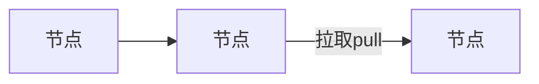

​  

# flask（是python的web框架）

#flask django

## django

“全栈”框架：内置ORM、Admin 后台、表单、认证、路由等全套工具，开箱即用

约定大于配置：强制遵守特定的项目结构（如models,views,template）

强调快速开发：适合需要快速构建标准化功能的应用(\_如CMS，电商平台)

## flask

“微框架”：核心仅包含路由和模块渲染，其他功能通过拓展按需添加

自由灵活：无强制项目结构，开发者可完全控制技术栈

适合定制化场景：如微服务，API 后端需要特殊架构的项目

​  

​  

#启动app应用，只适合在开发过程中使用，线上生产环境要使用专门的wsgi server启动qpp

#python web服务网关接口

​  

#专门的wsgi服务器 跑python应用

#我们用python专注于生成网页内容如html文档，而不希望接触到tcp连接，http原始请求和响应格式

#那就用专门的web服务器去运行python应用框架

​  

#gunicorn

gunicorn server:app

//运行当前目录下的server.py文件的app

gunicorn -w 4 --bind '0.0.0.0:8000' server:app

`-w` 是 `--workers` 的缩写，指定启动的**工作进程数量**

`--bind` 指定服务器监听的**IP 地址和端口**：

`0.0.0.0`：表示允许所有网络接口访问（即外部设备可以通过服务器的 IP 地址访问，而不仅限于本地 `127.0.0.1`）。

`8000`：监听的端口号（可根据需要修改，如 `80`、`5000` 等）。

`server`：指当前目录下的 `server.py` 文件（模块名）。

`app`：指 `server.py` 文件中定义的 WSGI 应用实例（通常是 `app = Flask(__name__)` 这样的代码定义的对象）。

#uwsgi

# 前后端分离

#svn git

git

缺点：

不好做权限控制

每个人都要保存数据，占用磁盘空间

优点：

离线也能修改代码

数据分布在各个节点，不容易丢失

## git bash使用

### git init//创建git本地仓库

//删除git仓库

直接删除当前目录下的.git文件就可以了

### git clone <远程仓库地址>

**克隆远程仓库**（从 GitHub/Gitee 等下载项目到本地

\# 例如：git clone https://github.com/username/repo.git

### git add

**暂存文件**（将修改加入暂存区，准备提交）

### git clone <远程仓库地址>

**克隆远程仓库**（从 GitHub/Gitee 等下载项目到本地）

### git status

\# 详细状态

**查看文件状态**（哪些文件被修改 / 新增 / 删除）

### git add <文件名>

\# 暂存单个文件，例如：git add app.py

### git commit -m

"提交说明" # 必须写清晰的说明，例如："修复登录bug"

​  

### git log

\# 详细历史（按 q 退出

### git reset --hard <commit ID>

\# 例如：git reset --hard a1b2c3d 回退版本

### git reset --hard HEAD~1

\# 回退到上一个版本（HEAD 表示当前版本，HEAD~1 表示上一个，~2 表示上两个）

### git checkout -- <文件名>

\# 例如：git checkout -- app.p

### git remote add origin <远程仓库地址>

添加别名，关联远程仓库

\# origin 是远程仓库的默认别名

### git remote #

列出远程仓库别名

**查看远程仓库信息**（通常是 origin）

### git remote -v

\# 显示别名对应的远程地址

### git push origin <本地分支名>

\# 例如：git push origin dev（推送本地 dev 到远程 dev）

### git push -u origin <分支名>

\# 首次推送时关联远程分支，后续可直接用 git push

​  

### git branch 创建或查看分支

\# 列出本地分支（当前分支前有 \*）

git branch -r # 列出远程分支

git branch -a # 列出所有分支（本地+远程）

git checkout -b <分支名> git switch -c <分支名> **创建并切换分支**

\# 例如：git checkout -b feature/login

git branch -d <分支名> # 删除已合并的分支

git branch -D <分支名> # 强制删除未合并的分支（谨慎使用）

  

  

## 路由（router）

url处理函数

/student /teacher

在服务端 url和视图函数的映射关系称为路由

#常用属性：

#args 接收传递过来的url携带的参数

#json 接收json格式数据传入

#form 接收表单格式数据传入

#headers 获取头部

#url

#path

### flask路由管理

1.当客户端请求，首先在url\_map中找到客户端请求的url

2.如果没有直接放回404，有这个url就找出对应的endpoint

3.再拿endpoint去view\_functions找对应的视图函数处理

endpoint全局唯一不能重复

​  

#### 动态url

尖括号里面放变量名

@app.route('/Logon/<username>/<password>',endpoint='loginweb',methods=['GET','POST'])

def loginweb(username,password):

if username == 'root' and password == '123456':

return '登录成功'

else:

return '登录失败'

## 请求（postman使用）

获取用户端请求时携带的数据/头部信息

​  

flask中所有请求数据都封装在一个对象中

  

#### 1.用「路径参数」（路由带 `<username>/<userage>`）

@app.route("/student/<username>/<userage>")

def student(username, userage):

print(f"路径参数 - username: {username}, userage: {userage}")

return f"Username: {username}, Userage: {userage}"

#### 2.用「查询参数」（路由不带路径参数，用 `?` 传递）

@app.route("/student") # 路由只写 /student，不带 <参数>

def student():

username = request.args.get("username")

userage = request.args.get("userage")

print(f"查询参数 - username: {username}, userage: {userage}")

return f"Username: {username}, Userage: {userage}"

​  

### 通过json格式传递数据

{

usernam：111

passwd：123456

}

  

## 响应（response）

api --json格式返回

code：程序状态码 设计 0为成功 非0为失败

data：返回的数据

message：对此次返回的说明

## 工程化管理

web开发软件设计模式

### 1.mvc

m -model(模型) 负责数据处理

v -view(视图) 用户界面展示

c -controller 负责接收请求，转发处理

### 2.mtv

m -model 数据

v -view --controller

t -template --view

项目拆分

  

## ORM映射

#orm relationship mapping

#对象关系映射

#对数据库操作的常见设计

|  | ORM | 直接查询 |
| --- | --- | --- |
| 开发效率 | 高 | 低 |
| 性能 | 可优化程度低 | 可优化程度高 |
| 灵活性 | 低 | 高 |
| 数据迁移 | 容易 | 困难 |

  

  

## api 设计 功能

| 请求路由 | 请求方法 | 接受参数 | 参数类型 | 返回数据 | 状态码 | ​ |
| --- | --- | --- | --- | --- | --- | --- |
| /student | GET | 无 | 无 | json | 0成功 |  |

### restful接口规范

#rest表现层状态转移

​  

非restful接口架构

/student/add post，put

/student/modify post，put

/student/delete

​  

#rest 每一类数据看作一种资源

/student

/teacher

#资源 通过http的动作实现状态转移 GET，POST，PUT，DELETE

#{version}{resource}{resource\_id}

#version API版本号,有些版本号放置在头信息，通过控制版本号有利于应用迭代

#resource 资源

#resource\_id 资源的id，

​  

#restful api设计

\# 方法  
#/v1/student post 新增  
\# get 查询所有学生  
#/v1/student/1 put 修改

\# delete 删除学生信息

\# get 查询某一个学生的具体信息

​  

## 数据库远端连接

创建一个名为 `flask` 的 MySQL 用户。

`create user "flask"@"%" identified by 'Asdf&24680';`

给 `flask` 用户分配权限。

`grant all privileges on *.* to 'flask'@'%' with grant option;`

刷新 MySQL 的权限表，使刚才的用户创建和权限分配立即生效（否则可能需要重启 MySQL 服务才生效）

`flush privileges;`

​  

​  

​  

## 数据库的关系（表设计）

数据库的设计

​  

​  

​  

# 认证

1.浏览器访问认证 --登录、

2.api授权认证 应用程序和服务之间

​  

​  

#http协议 无状态 本身不保存任何数据

​  

#会话保持机制

#cookie session

#客户端 服务端

​  

​  

​  

#token 验证

​  

  

| **特性** | **Cookie** | **Session** | **Token** |
| --- | --- | --- | --- |
| **存储位置** | 客户端（浏览器） | 服务器端 | 客户端（可存储在多种位置） |
| **安全性** | 较低（可被客户端修改，除非设 HttpOnly） | 较高（数据在服务器） | 中高（加密，但需妥善存储） |
| **状态** | 可持久化（设过期时间）或会话级 | 会话级（过期或关闭浏览器失效） | 无状态（服务器不存储会话数据） |
| **数据容量** | 小（约 4KB） | 可存储较多数据 | 通常较小（仅为凭证） |
| **传递方式** | 自动随请求发送（同一域名） | 通过 Cookie 传递 Session ID | 手动在请求头 / 参数中携带 |
| **适用场景** | 存储少量非敏感信息、会话标识 | 存储用户会话状态、临时数据 | API 认证、第三方登录、跨域请求 |

## JWT规范

#jwt (JSON Web Token) 是一种开放标准（RFC 7519）,用于在各方之间以JSON对象的形式安全的传输信息的一种规范

​  

#一个JWT令牌由三个部分组成，用 . 分隔

#xxxxx.yyyyy.zzzzz

​  

第一部分：Header（头部）

包含令牌类型和签名算法：

{

"alg":"HS256",

"typ":"JWT"

}

第二部分：payload

关于用户和附加信息的JSON数据

{

"id":1,

"username":"KBL",

"exp":1727779154， #过期时间

"iss":"myapp"

}

第三部分：Signature（签名）

用于验证令牌完整性和防止篡改

​  

​  

## api授权认证

  

