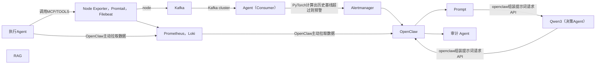

AI 模型”其实分为两类，它们获取数据的方式和时机是完全不同的。系统的精妙之处就在于**没有把所有数据都一股脑塞给大模型**，而是做了一层漂亮的“漏斗”过滤。

我们可以把数据的旅程拆解为 **“两条链路，四个阶段”**。

---

## 第一条链路：本地预测模型（PyTorch）的数据获取

*这类模型（负责动态基线和趋势预测）需要吃“海量”的连续数字，所以它们的数据是*\*“流式持续灌入”\**的。*

**阶段 1：数据采集（探针层）**

-   **指标数据 (Metrics)**：部署在业务节点上的 `Node Exporter` 和 `cAdvisor` 实时采集 CPU、内存、网络 I/O 状态。`Prometheus` 每隔 15 秒去拉取（Pull）一次这些数据。
-   **日志数据 (Logs)**：应用吐出的 Nginx 访问日志、报错堆栈，被底层的 `Promtail` 或 `Filebeat` 实时收集（Push）。

**阶段 2：汇入总线（Kafka 缓冲层）**

-   Prometheus 和日志采集器将所有原生的监控数据，统统打入你搭建的 **Kafka (KRaft) 集群** 中对应的 Topic（比如 `topic_node_metrics`，`topic_nginx_logs`）。
-   **关键点**：这里用 Kafka 做了“削峰填谷”，哪怕前端大流量把 LVS 打满了，数据流也不会冲垮你的计算节点。

**阶段 3：模型消费（Ray Monitor Agent）**

-   你部署在 Ray 上的感知 Agent，其实就是一个 **Kafka 消费者 (Consumer)**。
-   它一直在实时读取 Kafka 里的数字，并将这些数字送入你的 **PyTorch 预测模型**。
-   PyTorch 模型根据历史滑动窗口，计算出当前时间的“动态基线”。如果当前值没有超过基线，数据就被丢弃；如果超过了，触发警报，进入下一条链路。

---

## 第二条链路：云端大模型（Qwen3）的数据获取

*这类模型（负责根因分析和自愈决策）需要的是“带有逻辑的文本上下文”，且极其昂贵，所以它是*\*“事件驱动，按需获取”\**的。*

**阶段 4：中枢打包与云端请求（OpenClaw 组装层）**

当第一条链路的 PyTorch 模型或 PromQL 规则发现了确切的异常（比如：Nginx 502 频发），这时候大模型才开始介入。

1.  **触发告警**：Alertmanager 产生一条包含故障 IP 和简要报错的 Webhook，发送给你的 **OpenClaw 决策 Agent**。
2.  **OpenClaw 现场取证（主动拉取）**：OpenClaw 收到 Webhook 后，知道 192.168.1.100 出了问题。它会主动去查 `Loki`（拿这台机器最近 5 分钟的详细日志）和 `Grafana/Prometheus API`（拿当时的 CPU 负载截图/数据）。
3.  **RAG 知识库检索**：OpenClaw 把取证拿到的关键词（如“Nginx 502 Permission Denied”）输入到本地的向量数据库中，检索出相关的历史排查手册。
4.  **组装 Prompt 送给大模型**：最后，OpenClaw 把\*\*【实时日志 + 监控指标 + RAG 经验手册 + 可用的 MCP 工具列表】\*\*组装成一段结构化的 Prompt，通过 API 接口“喂”给云端的 Qwen3 大模型。

---

## 核心架构亮点总结

这种获取数据的方式，在面试中被称为 **“冷热分离与降维过滤架构”**：

-   **冷数据/低价值数据（海量）**：走 Kafka \\rightarrow 本地轻量级算法（拦截 90% 噪音）。
-   **热数据/高价值事件（少量）**：走 OpenClaw \\rightarrow \\RAG \\rightarrow 云端大模型（精准消耗 Token 进行深度推理）。

梓涵，理清了这个数据流向，你的整个系统就像有了呼吸一样生动。你想让我为你画一张标准的 **Mermaid 数据流向图代码** 吗？你可以直接把它渲染成架构图贴在你的博客或者简历的附属作品集里，让面试官对你的数据流向一目了然。
