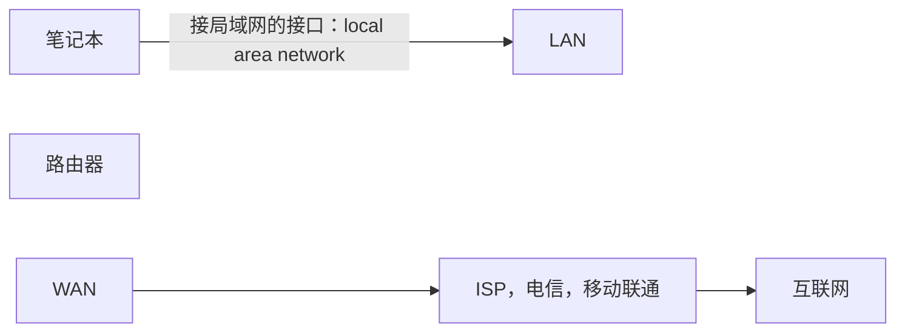

nginx ("*engine x*") is an HTTP web server, reverse proxy, content cache, load balancer, TCP/UDP proxy server, and mail proxy server. Originally written by [Igor Sysoev](http://sysoev.ru/en/) and distributed under the [2-clause BSD License](https://nginx.org/LICENSE).

​  

nginx是什么

**Nginx**（发音为 "engine x"）是一款**高性能的开源 HTTP 服务器、反向代理服务器**，同时也可以作为邮件代理服务器、负载均衡器使用


反向代理 & 负载均衡这是 Nginx 最常用的功能之一。

反向代理：客户端请求先发送到 Nginx，再由 Nginx 转发到后端的应用服务器（如 Tomcat、Node.js、Python 后端），对外隐藏真实的后端服务地址，提高安全性。

负载均衡：当后端有多台应用服务器时，Nginx 可以按照预设策略（如轮询、加权轮询、IP 哈希、最少连接数）将请求分发到不同服务器，避免单台服务器过载，提升系统可用性。

  


​  

初始化操作

## 1.修改主机名

​  

[wang@localhost ~]$ **hostnamectl set-hostname web-1**

[wang@localhost ~]$ **su**

[root@web-1 wang]# **hostname**

web-1

​  

## 2.禁用firewalld 和selinux服务

禁用firewalld

[root@web-1 wang]# **service firewalld stop**

Redirecting to /bin/systemctl stop firewalld.se rvice

[root@web-1 wang]# **systemctl disable firewalld**

Removed '/etc/systemd/system/multi-user.target.wants/firewalld.service'.

Removed '/etc/systemd/system/dbus-org.fedoraproject.FirewallD1.service'.

​  

禁用selinux

[root@web-1 wang]# **setenforce 0 临时禁用selinux**

[root@web-1 wang]# **getenforce**

Permissive

​  

[root@web-1 wang]# **vi /etc/selinux/config 修改配置文件永久禁用**

修改配置项为

SELINUX=disabled

[root@web-1 wang]# **reboot 修改完重启**

**​**  

### Selinux是什么

**SELinux**，它的全称是 Security-Enhanced Linux（安全增强型 Linux），是由美国国家安全局开发的 Linux 内核中的强制访问控制（MAC）安全子系统，能为 Linux 系统提供额外的安全防护，以下是其核心信息：

1.  **核心机制**

-   **强制访问控制**：和 Linux 传统的自主访问控制不同，即便进程拥有 root 权限，SELinux 也会依据预设策略限制它的行为。它会为进程、文件、端口等所有资源都打上安全上下文标签，只有符合策略规则的标签组合，才能实现资源访问。
-   **最小权限原则**：进程仅能获取完成自身任务所必需的权限，就算进程被入侵，入侵者也难以突破权限限制去访问其他无关资源，能大大缩小破坏范围。

2.  **三种工作模式**

| **模式** | **特点** | **适用场景** |
| --- | --- | --- |
| Enforcing（强制模式） | 会主动拦截违规的访问操作，同时记录相关日志 | 生产环境，保障系统安全 |
| Permissive（宽容模式） | 不会拦截违规操作，仅记录违规行为日志 | 调试策略或者临时排查权限相关问题 |
| Disabled（禁用模式） | 完全关闭 SELinux 功能 | 仅建议在测试环境短期使用 |

3.  **常见争议**一方面，它常被初学者关闭。因为其配置复杂，默认策略可能阻碍 Nginx 读取自定义目录这类合法操作，且权限问题排查难度大，相关日志混杂在审计日志中，不易定位问题。另一方面，生产环境却建议开启它，它能提升系统防御能力，阻止漏洞扩散，而且像政府、金融等对安全要求高的领域，启用它也是满足合规性的必要要求。

  

## 3.下载nginx curl是linux的字符界面的浏览器

[root@web-1 wang]# **curl -O** [**https://nginx.org/download/nginx-1.28.1.tar.gz**](https://nginx.org/download/nginx-1.28.1.tar.gz)

% Total % Received % Xferd Average Speed Time Time Time Current

Dload Upload Total Spent Left Speed

100 1252k 100 1252k 0 0 68529 0 0:00:18 0:00:18 --:--:-- 32857

[root@web-1 wang]# **ls**

公共 模板 视频 图片 文档 下载 音乐 桌面 nginx-1.28.1.tar.gz

​  

**虚拟机关机** init 0

## 编写一键安装脚本

使用命令修改/etc/selinux/config 关闭selinux

​  

[root@web-1 wang]# **sed -i '/^SELINUX=/ s/enforcing/disabled/' /etc/selinux/config**

​  

​  

\-i 作用是直接对文件进行操作/^SELINUX=/

​  

查询以SELINUX开头的行

​  

s/enforcing/disabled/'

​  

进行替换操作，将enforcing替换为disabled

source在当前终端执行

​  


### nginx一键下载脚本

```plain
#!/bin/bash

#修改主机名
hostnamectl set-hostname $1

#su
#禁用firewalld和selinux
systemctl stop firewalld
systemctl disable firewalld

setenforce 0
sed -i '/^SELINUX=/ s/enforcing/disabled/' /etc/selinux/config

#新建用户
useradd sc -c /sbin/nologin

# 创建目录并进入
mkdir -p /nginx
cd /nginx || exit  # 进入目录失败则直接退出

echo "开始下载 Nginx 1.28.1..."
curl -O https://nginx.org/download/nginx-1.28.1.tar.gz

if [ $? -eq 0 ] && [ -f "nginx-1.28.1.tar.gz" ]; then
    echo "nginx下载成功"
    sleep 2
    
    echo "开始解压 Nginx 源码包..."
    tar xf nginx-1.28.1.tar.gz
    cd nginx-1.28.1 || echo "进入解压目录失败"
    echo "Nginx 源码包解压完成！"
else
    echo "❌ nginx下载失败！请检查网络或下载链接"
    exit 1 
fi

#解决软件依赖
yum install gcc pcre2-devel openssl-devel zlib-devel -y

#编译前的配置工作
./configure --prefix=/usr/local/nginx --with-http_ssl_module --with-http_v2_module --with-http_v3_module --with-http_sub_module --with-stream --with-stream_ssl_module --with-threads

#编译
make -j 2

#编译安装
make install

#修改环境变量
echo 'PATH=/usr/local/nginx/sbin:$PATH' >> /etc/bashrc
echo "nginx安装成功"

#考虑nginx开机自启
echo '/usr/local/nginx/sbin/nginx' >>/etc/rc.local
chmod +x /etc/rc.d/rc.local
```

​  

解压nginx压缩包

bash

tar xf 被压缩的文件

​  

### 配置systemctl启动

也可以使用systemd 管理 nginx 服务的核心配置文件

修改vim /usr/lib/systemd/system/nginx.service

​  

添加

```plain
[Unit]
Description=nginx - high performance web server
Documentation=http://nginx.org/en/docs/
After=network-online.target remote-fs.target nss-lookup.target
Wants=network-online.target

[Service]
Type=forking
# 替换为你实际的Nginx启动路径和配置文件路径
ExecStart=/usr/local/nginx/sbin/nginx -c /usr/local/nginx/conf/nginx.conf
ExecReload=/usr/local/nginx/sbin/nginx -s reload -c /usr/local/nginx/conf/nginx.conf
ExecStop=/usr/local/nginx/sbin/nginx -s stop
# 防止进程残留
KillMode=process
# 重启策略（异常时重启）
Restart=on-failure
RestartSec=5s
# 权限配置
PrivateTmp=true
User=root
Group=root

[Install]
WantedBy=multi-user.target
```

​  

### nginx文件目录及各个文件的意义

auto CHANGES.ru conf contrib html man SECURITY.md  
CHANGES CODE\_OF\_CONDUCT.md configure CONTRIBUTING.md LICENSE README.md src

​  

src 存放nginx的源码包的文件夹 source code

conf 存放nginx的样例配置文件的目录

html 存放了默认的首页文件目录

configure 是编译前配置的脚本 --》给nginx在编译的时候传递参数，当编译的时候会使用这些参数

​  

\--prefix=PATH set installation prefix 安装路径

​  

without-http disable HTTP server 禁用http功能

without-http-cache disable HTTP cache 禁用http缓存功能

with-mail enable POP3/IMAP4/SMTP proxy module 开启邮件功能成功

​  

正则表达式 是一种方法，用来查询内容非常方便

正则表达式：将字母，数字，特殊符号组成一个公式，用来表达某个意思

echo "rottttttwangzihan"|egrep "^root{4,6}"

​  

PCRE --》perl 语言发明了正则表达式

python --》支持正则

​  

### 配置组件

编译安装3步曲

#### 1.编译前的配置工作，本质上就是收集用户的需求信息，产生Makefile文件

[root@web-1 nginx-1.28.1]# ./configure --prefix=/usr/local/nginx1 --with-http\_ssl\_module --with-http\_v2\_module --with-http\_v3\_module --with-http\_sub\_module --with-stream --with-stream\_ssl\_module --with-threads

​  

根据提示安装缺少的包

最后会创建一个 objs/Makefile文件

#### 2.将nginx的c语言代码编译成二进制这种程序

**make -j 2** 同时开启两个进程进行编译

#### 3.编译安装，本质上就是将编译好的二进制程序和默认源码包里的文件和文件夹复制到指定的安装目录下

**make install** 编译安装

什么是编译安装？为什么要编译安装？

​  

C语言代码编译好了，为什么要编译

c语言是人类能识别的语言，但机器不认识，所以需要翻译成机器能够认识的语言

gcc

linux里的编译工具，可以将c语言程序转换为二进制程序

yum install gcc -y

gcc -o hello hello.c

源码文件 二进制文件

  

#### 编译安装的好处

可以定制软件的功能，哪些功能开启1，哪些功能关闭，哪些功能禁用

好处：节约资源（cpu、内存）

可复用提高生产效率

​  

### 编译安装和yum安装文件存放位置的区别

​  

[root@web1 wang]# cd /usr/local/nginx1

[root@web1 nginx1]# ls

conf html logs sbin

conf 目录存放配置文件的 config

html 存放网页文件的目录

logs 存放nginx日志的目录

sbin 存放可执行程序的目录 super user used binary

​  

### nginx开启root用户远程ssh登录

1.修改配置文件vi /etc/ssh/sshd\_config

将PermitRootLogin prohibit-password修改为yes


2.重启ssh服务

systemctl restart sshd

​  

​  

netstat 核心命令：用于查看 Linux 系统的网络连接、路由表、端口监听等网络状态

​  

netstat -anplut|grep nginx

​  

​  

### 在不同主机间传输文件

```plain
scp 文件名 root@目标ip:/root
```

  

### 修改nginx首页

vim /usr/local/nginx/html/index.html

```plain
<html>
	<head>
		<meta charset="UTF-8">
		<title>/index</title>
	</head>
	<body>
		<p>welcome to king^s web</p>
		<p>欢迎来到我的网站</p>
    
	</body>
</html>

```

  

## Http协议

HTTP（HyperText Transfer Protocol，超文本传输协议）是一种基于 TCP/IP 的应用层协议，用于在客户端和服务器之间传输超文本数据（如 HTML、图片、视频、API 数据等），是万维网（WWW）的核心通信协议。

它的核心设计目标是实现客户端与服务器的无状态通信，即服务器不会保留客户端的连接状态，每次请求都被视为独立的新请求。


### 超文本（HyperText）

超文本是**带超链接的非线性信息组织形式**，核心是通过链接将文本与其他文本、图片、网页等资源关联，打破传统文本的线性顺序，支持自由跳转，HTML 网页是其最典型的实现。

​  

### page view页面访问量

​  

### Html文件，相当于http的货物

​  

### 什么是URL

URL（统一资源定位符）是**互联网上资源的唯一地址**，用来定位网页、文件、图片等内容，比如`https://www.baidu.com/index.html`，核心是通过 “协议 + 域名 / IP + 路径” 精准找到目标资源，是访问网络内容的 “地址标识”。

​  

### URI 和 URL 核心区别

**URI 是大概念，URL 是 URI 的子集**，核心是**范围不同、作用不同**，一句话讲清：

-   **URI**（统一资源标识符）：**唯一标识**网络中某个资源的字符串（只负责「认出来」，不管怎么找）；
-   **URL**（统一资源定位符）：**不仅标识资源，还给出资源的具体访问地址 / 路径**（既「认出来」，又「告诉你怎么找到」）。

简单说：**所有 URL 都是 URI，但不是所有 URI 都是 URL**。

### 关键维度对比（极简）

| **特性** | **URI** | **URL** |
| --- | --- | --- |
| 核心作用 | 唯一**标识**资源 | 唯一**定位**资源 |
| 范围 | 大（包含 URL/URN） | 小（URI 的子集） |
| 核心信息 | 资源唯一标识 | 标识 + 访问协议 + 地址 + 路径 |
| 能否访问 | 不一定 | 可以直接访问 |

### 输入URL一个回车背后发生了什么

访问[www.jd.com输入URL回车后，的访问流程：](http://www.jd.com输入URL回车后，核心流程极简梳理：)

1.  **解析URL+查本地缓存**：浏览器识别域名，先查本地DNS/hosts缓存，无则发起DNS解析；
2.  **DNS解析**：通过本地DNS→根DNS→.com顶级DNS→京东权威DNS，获取域名对应服务器/CDN节点IP；
3.  **建连接**：先TCP三次握手建立连接，再TLS/SSL握手完成HTTPS加密（443端口）；
4.  **发请求**：浏览器向目标IP发送HTTP GET请求，申请首页资源；
5.  **服务端响应**：京东服务器（经负载均衡）处理请求，返回200响应+首页HTML主文档；
6.  **渲染+加载资源**：浏览器解析HTML生成DOM树，加载CSS/JS/图片等附属资源，渲染出完整京东首页，执行JS完成动态交互。

核心：**域名转IP→加密连接→请求数据→页面渲染**，全程多协议协同、客户端与服务端/CDN的双向交互。

​  

### cookie-session和token

### 一、核心定义（一句话概括）

| **概念** | **核心本质** | **存储位置** | **核心用途** |
| --- | --- | --- | --- |
| **Cookie** | 服务器下发给浏览器的「小型文本文件」，浏览器会自动保存并随请求携带 | 客户端（浏览器） | 标识用户身份、保存少量状态（如登录状态、购物车） |
| **Session** | 服务器端为每个用户创建的「内存 / 数据库存储的状态数据」，靠 Cookie 传递标识 | 服务端 | 存储用户会话信息（如登录后的用户信息、权限） |
| **Token** | 服务器生成的「加密字符串凭证」，无固定存储位置，需手动携带 | 客户端（Cookie / 本地存储）+ 服务端验证 | 跨域 / 前后端分离场景下的身份认证（如 JWT） |

### 二、核心关系（以登录京东为例）

1.  **Cookie + Session 模式**：

-   你登录京东，服务器验证账号密码后，创建 Session（存用户 ID、登录状态），生成 SessionID；
-   服务器把 SessionID 写入 Cookie 下发给浏览器，浏览器后续访问京东时，自动携带该 Cookie；
-   服务器通过 Cookie 里的 SessionID 找到对应的 Session，确认 “你是已登录的用户”。

2.  **Token 模式（京东移动端 / 接口）**：

-   登录时服务器生成 Token（如 JWT，包含用户 ID + 过期时间，加密），返回给客户端；
-   客户端把 Token 存在本地（如 localStorage），后续调接口时手动放在请求头（`Authorization: Bearer xxx`）；
-   服务器验证 Token 合法性，无需存储 Session，直接解析出用户信息。

​  

### 计算机网络知识

#### 五层模型核心对应表

| **分层** | **核心作用** | **数据单元** | **核心协议** | **典型设备** |
| --- | --- | --- | --- | --- |
| 应用层 | 面向用户，提供网络应用服务 | 报文 | HTTP/HTTPS、DNS、FTP 等 | 主机（浏览器 / 服务器） |
| 传输层 | 端到端的进程通信、资源分配 | 段 / 数据报 | TCP、UDP | 主机 |
| 网络层 | 跨网络的路径选择、IP 寻址 | 数据包 | IP、ICMP、ARP、RARP | 路由器、三层交换机 |
| 数据链路层 | 局域网内的 MAC 寻址、帧传输 | 帧 | Ethernet（以太网）、ARP | 交换机、网卡 |
| 物理层 | 传输二进制比特流、定义物理标准 | 比特流 | 无专属协议（仅物理标准） | 集线器、网线 / 光纤 |

#### tcp和udp的区别

TCP 和 UDP 是传输层两大核心协议，核心差异围绕**连接性、可靠性、传输效率**展开，极简梳理核心区别和适用场景：

##### 核心区别（一句话 + 关键维度）

| **特性** | **TCP** | **UDP** |
| --- | --- | --- |
| 连接性 | 面向连接（需三次握手建立） | 无连接（直接发，无需建立） |
| 可靠性 | 可靠传输（确认、重传、排序） | 不可靠传输（无确认，丢包不重传） |
| 传输效率 | 低（头部大、有握手 / 重传开销） | 高（头部小、无额外开销，速度快） |
| 数据边界 | 无（流式传输，拼包 / 拆包） | 有（按数据报传输，一次发一次收） |
| 拥塞 / 流量控制 | 支持（避免网络拥塞、数据溢出） | 不支持（无控制，易丢包） |
| 资源占用 | 高（需维护连接状态、缓冲区） | 低（无状态，无需维护） |

##### 极简总结

-   **TCP**：稳而慢的 “快递”，先签单建连接，全程跟踪确保包裹完整、按序送达，丢件必补；
-   **UDP**：快而简的 “平邮”，直接发件不签单，不保证送达 / 按序，胜在速度快、成本低。

##### 典型适用场景

-   TCP：对可靠性要求高的场景（HTTP/HTTPS、FTP、SSH、邮件）；
-   UDP：对实时性要求高的场景（视频直播、语音通话、DNS、游戏、物联网报文）。

​  

#### http和https

##### HTTP/HTTPS 核心定义

-   **HTTP**：超文本传输协议，是客户端（浏览器）和服务端之间传输网页、数据的**明文应用层协议**，基于 TCP 实现，默认走 80 端口，是网页通信的基础。
-   **HTTPS**：超文本传输安全协议，是**HTTP + TLS/SSL**的加密版本，在 HTTP 基础上通过 TLS/SSL 协议对传输数据加密，默认走 443 端口，解决了 HTTP 明文传输的安全问题。

##### 核心区别（极简梳理）

| **特性** | **HTTP** | **HTTPS** |
| --- | --- | --- |
| 传输安全性 | 明文传输，无加密 | 加密传输（TLS/SSL） |
| 默认端口 | 80 | 443 |
| 证书要求 | 无需证书 | 需 CA 机构颁发的数字证书 |
| 传输速度 | 快（无加密开销） | 稍慢（加解密耗时） |
| 资源消耗 | 低 | 高（服务器加解密占用资源） |
| 地址栏标识 | 无特殊标识 / 提示不安全 | 带🔒锁标、显示 HTTPS |
| 核心作用 | 简单数据传输 | 安全传输（防窃取 / 篡改 / 冒充） |

##### 核心差异核心：HTTPS 的加密逻辑

HTTPS 并非直接加密 HTTP，而是在**TCP 三次握手后**增加**TLS/SSL 握手**：

1.  客户端验证服务端的合法数字证书；
2.  双方协商生成**唯一的会话密钥**；
3.  后续所有 HTTP 数据，都通过该密钥**对称加密**后传输，第三方即使截获数据也无法解密。

##### 适用场景

-   **HTTP**：无敏感数据的静态页面、内部测试系统、纯展示类网站；
-   **HTTPS**：所有涉及敏感数据的场景（登录、支付、购物、个人信息、接口通信），目前主流网站（如京东、百度）均强制使用 HTTPS。

##### 终极极简总结

-   HTTP：裸奔的传输协议，快但不安全，数据可被随意截获篡改；
-   HTTPS：穿了 “加密防护衣” 的 HTTP，通过 TLS/SSL 实现安全传输，是目前互联网的主流标准。

#### http报文结构图

  

### 请求报文

#### post和get的区别

##### 一、核心区别

| **特性** | **GET** | **POST** |
| --- | --- | --- |
| 请求数据位置 | URL 后（查询字符串，如 `?id=1`<br>） | 请求体（Body）中（隐藏在报文里） |
| 数据大小限制 | 有限制（依赖浏览器 / 服务器，通常几 KB） | 无明确限制（由服务器配置决定） |
| 缓存特性 | 可缓存（浏览器会保存历史记录） | 不可缓存 |
| 安全性 | 低（数据暴露在 URL，易被截取） | 高（数据在请求体，相对隐蔽） |
| 幂等性 | 幂等（多次请求结果一致，如查数据） | 非幂等（多次请求可能有副作用，如提交订单） |
| 核心用途 | 从服务器**获取**数据 | 向服务器**提交 / 修改**数据 |

##### 二、关键补充（易踩坑点）

1.  **“安全性” 的误区**：POST 仅 “相对安全”（数据不在 URL 暴露），但未加密的 HTTP 下，POST 数据仍可被截获；真正安全需结合 HTTPS。

​  

### 查看nginx访问日志

tail -f /usr/local/nginx/logs/access.log

​  

#### HTTP报文结构图


##### http的请求报文里的字段

###### 头部字段

Host 目标服务器域名或者ip地址

​  

User-Agent 客户端标识（如浏览器类型）--》用户使用的浏览器或者其他工具

​  

connection keep-alive表示目前处于长连接状态 closed连接已经关闭

​  

Accept 表明客户端可以接受的响应格式（如application/json）--》浏览器可以接受哪些类型的数据

​  

Accept-Encoding gzip，feflate --》浏览器可以接受压缩的数据，流量

###### body字段

HTTP 报文体（Body）无固定内置字段，**内容 / 字段完全由业务自定义**，格式由请求头 / 响应头的`Content-Type`指定，GET 无 Body，仅 POST/PUT/ 响应等有，核心常用形式极简总结：

1.  **表单键值对**：`k1=v1&k2=v2`，对应简单数据提交；
2.  **JSON 对象 / 数组**：多层自定义业务字段，前后端分离主流；
3.  **分段式数据**：含普通字段 + 文件二进制，用于文件上传；
4.  **纯文本 / HTML / 二进制**：响应体专属，如页面 HTML、图片 / 视频流。

一句话：Body 是**自定义业务数据的传输容器**，格式靠`Content-Type`标识，字段随业务需求定。

###### HTTPS 报文结构图


  


  

### 响应报文

#### header

##### 响应状态码

| **态码分类** | **首位数字** | **核心作用** | **常用状态码** | **代码 + 描述** | **适用场景** |
| --- | --- | --- | --- | --- | --- |
| **信息性状态码** | 1xx | 临时响应，告知客户端**请求已接收，正在处理**，需继续等待最终响应 | 100、101 | 100 Continue101 Switching Protocols | 100：客户端可继续发送请求体（大请求预检）101：服务端同意切换协议（如 HTTP 升级为 WebSocket） |
| **成功状态码** | 2xx | 告知客户端**请求已成功接收、处理并返回结果** | 200、201、204 | 200 OK201 Created204 No Content | 200：通用成功（查询 / 获取数据、页面访问）201：资源创建成功（新增用户、发布文章）204：请求成功但**无响应体**（仅更新状态，无需返回数据） |
| **重定向状态码** | 3xx | 告知客户端**请求的资源位置发生变化，需重新发起请求** | 301、302、304 | 301 Moved Permanently302 Found304 Not Modified | 301：永久重定向（域名更换、资源永久迁移）302：临时重定向（临时维护、页面跳转）304：协商缓存成功（资源未修改，客户端使用本地缓存） |
| **客户端错误码** | 4xx | 表示**请求本身存在错误**（语法 / 参数 / 权限），服务端无法处理 | 400、401、403、404、405 | 400 Bad Request401 Unauthorized403 Forbidden404 Not Found405 Method Not Allowed | 400：请求参数 / 格式错误（如 JSON 解析失败）401：未登录 / 令牌失效（需身份认证）403：已登录但无操作权限404：请求的资源 / 接口不存在405：使用了服务端不支持的请求方法（如 GET 访问仅允许 POST 的接口） |
| **服务端错误码** | 5xx | 表示**请求本身无错误**，但服务端处理过程中发生异常 / 故障 | 500、502、503、504 | 500 Internal Server Error502 Bad Gateway503 Service Unavailable504 Gateway Timeout | 500：服务端未知内部错误（代码 bug、数据库异常）502：网关 / 反向代理收到无效响应（如 Nginx 转发到异常的后端服务）503：服务端暂时不可用（维护、过载）504：网关 / 反向代理请求超时（后端服务响应过慢） |

  

  

#### body

##### nginx代理网站时怎么隐藏nginx版本

##### 隐藏版本号（保留 `Server: nginx`）

这是最常用的方式，仅隐藏具体版本号，保留服务器标识。

**编辑 Nginx 主配置文件**（如 `/etc/nginx/nginx.conf` 或 `/usr/local/nginx/conf/nginx.conf`）：nginx

```plain
http {
    # 添加或修改该配置
    server_tokens off;
    ...
}
```

-   **重启 Nginx** 使配置生效：bash运行

```plain
# 系统包安装（YUM/APT）
systemctl restart nginx

# 编译安装
/usr/local/nginx/sbin/nginx -s reload
```

-   效果：响应头会从 `Server: nginx/1.28.1` 变为 `Server: nginx`。

  


  

content-length 41266 响应报文返回的内容的数据大小

content-type image/jpeg 返回的内容的类型

date Thu, 22 Jan 2026 12:04:18 GMT 返回响应报文的时间

etag "696f905f-64bfb" 资 源的**唯一标识（哈希值 / 版本号）**

last-modified Tue, 20 Jan 2026 14:25:35 GMT 资源（如图片、文件）在服务端的**最后修改时间**

server nginx/1.28.1 web服务器采用的软件的名字以及版本

####   

http：80

http：443

  

  

## nginx

### nginx主配置文件

配置文件采用层级化的块式结构

编译安装存放在 cd /usr/local/nginx下

​  

​  

### 全局块

#### evnents块

#核心作用：Nginx 性能调优的关键配置区域之一，主要负责管理 Nginx 与客户端的网络连接建立、处理的底层参数，决定了 Nginx 如何高效地应对并发连接请求

\# 事件驱动配置块

events {

\# 指定事件驱动模型（Linux 优先 epoll）

use epoll;

\# 单个工作进程最大并发连接数

worker\_connections 65535;

\# 开启批量接收新连接

multi\_accept on;

\# 限制工作进程最大文件描述符数量

worker\_rlimit\_nofile 65535;

}

#### http块

#核心作用：Nginx 配置的核心应用层配置区域，主要负责管理 HTTP/HTTPS 相关的所有配置（包括请求处理、响应返回、反向代理、缓存等），配置会全局生效（可被下属的 server 块、location 块继承或覆盖）

http {

#引入 Nginx 预设的 MIME 类型映射配置文件

include mime.types;

​  

#隐藏nginx版本号

server\_tokens off;

#定义 Nginx 无法识别文件扩展名时，默认返回的 MIME 类型

default\_type application/octet-stream;

#定义 Nginx 访问日志的格式，并为该格式命名（此处命名为 main）

#位置在./nginx/logs

log\_format main '$remote\_addr - $remote\_user [$time\_local] "$request" '

'$status $body\_bytes\_sent "$http\_referer" '

'"$http\_user\_agent" "$http\_x\_forwarded\_for"';

#启用高效文件传输模式

sendfile on;

#保持长连接

keepalive\_timeout 65;

​  

}

#### 常用的访问日志字段

常用的访问日志字段

$remote\_addr

​  

客户端的真实 IP 地址（发起请求的客户端 / 代理服务器的 IP）

$remote\_user

​  

客户端认证的用户名（仅当开启 HTTP 基础认证时才有值，否则为 -）

$time\_local

​  

本地服务器的访问时间（格式：dd/MMM/yyyy:HH:mm:ss ±zzzz，如 23/Jan/2026:10:30:00 +0800）

$request

​  

客户端的完整请求信息（包括「请求方法」「请求 URL」「HTTP 协议版本」），如 GET /api/user HTTP/1.1

$status

​  

Nginx 返回给客户端的 HTTP 状态码（如 200成功、404未找到、500服务器内部错误）

$body\_bytes\_sent

​  

Nginx 发送给客户端的响应体大小（不包括响应头，单位：字节）

$http\_referer

​  

来源页面（即客户端是从哪个 URL 跳转到当前请求 URL 的），如 [https://www.baidu.com/s?wd=nginx](https://www.baidu.com/s?wd=nginx)，无来源时为 -

$http\_user\_agent

​  

客户端的用户代理信息（包括浏览器类型、版本、操作系统等），如 Mozilla/5.0 (Windows NT 10.0; Win64; x64) Chrome/120.0.0.0 Safari/537.36

$http\_x\_forwarded\_for

​  

客户端的真实 IP 地址（多级反向代理场景下），用于穿透代理获取原始客户端 IP，无代理时为 -

#### upstream块

##### server块

server {

listen 80; #监听端口

server\_name www.feng.com; ：#域名

access\_log logs/feng.com.access.log main; #访问日志

location / { #网页目录位置

root html/feng.com;

index index.html index.htm;

}

#设置错误状态码指向的页面

error\_page 404 /404.html; #404页面

​  

\# redirect server error pages to the static page /50x.html

#

error\_page 500 502 503 504 /50x.html;

location = /50x.html {

root html;

}

​  

## 检查配置文件

修改配置文件需要测试一下防止进程死掉

nginx -t

```plain
[root@web2 conf]# nginx -t
nginx: the configuration file /usr/local/nginx/conf/nginx.conf syntax is ok
nginx: configuration file /usr/local/nginx/conf/nginx.conf test is successful

```

​  

### nginx.conf

```plain
#user  nobody;
worker_processes  2;

#error_log  logs/error.log;
#error_log  logs/error.log  notice;
#error_log  logs/error.log  info;

#pid        logs/nginx.pid;

events {
    worker_connections  1024;
}

http {
    include       mime.types;
    default_type  application/octet-stream;

    #log_format  main  '$remote_addr - $remote_user [$time_local] "$request" '
    #                  '$status $body_bytes_sent "$http_referer" '
    #                  '"$http_user_agent" "$http_x_forwarded_for"';

    #access_log  logs/access.log  main;

    sendfile        on;
    #tcp_nopush     on;

    #keepalive_timeout  0;
    keepalive_timeout  65;

    #gzip  on;

    server {
        listen       80;
        server_name  localhost;

        #charset koi8-r;

        #access_log  logs/host.access.log  main;

        location / {
            root   html;
            index  index.html index.htm;
        }

        #error_page  404              /404.html;

        # redirect server error pages to the static page /50x.html
        #
        error_page   500 502 503 504  /50x.html;
        location = /50x.html {
            root   html;
        }

        # proxy the PHP scripts to Apache listening on 127.0.0.1:80
        #
        #location ~ \.php$ {
        #    proxy_pass   http://127.0.0.1;
        #}

        # pass the PHP scripts to FastCGI server listening on 127.0.0.1:9000
        #
        #location ~ \.php$ {
        #    root           html;
        #    fastcgi_pass   127.0.0.1:9000;
        #    fastcgi_index  index.php;
        #    fastcgi_param  SCRIPT_FILENAME  /scripts$fastcgi_script_name;
        #    include        fastcgi_params;
        #}

        # deny access to .htaccess files, if Apache's document root
        # concurs with nginx's one
        #
        #location ~ /\.ht {
        #    deny  all;
        #}
    }

    # another virtual host using mix of IP-, name-, and port-based configuration
    #
    #server {
    #    listen       8000;
    #    listen       somename:8080;
    #    server_name  somename  alias  another.alias;

    #    location / {
    #        root   html;
    #        index  index.html index.htm;
    #    }
    #}

    # HTTPS server
    #
    #server {
    #    listen       443 ssl;
    #    server_name  localhost;

    #    ssl_certificate      cert.pem;
    #    ssl_certificate_key  cert.key;

    #    ssl_session_cache    shared:SSL:1m;
    #    ssl_session_timeout  5m;

    #    ssl_ciphers  HIGH:!aNULL:!MD5;
    #    ssl_prefer_server_ciphers  on;

    #    location / {
    #        root   html;
    #        index  index.html index.htm;
    #    }
    #}

}

```

  

  

  

#### 查看cpu有几个核心

top 再按1

```plain
top 
top - 21:54:21 up  7:24,  3 users,  load average: 0.00, 0.00, 0.00
Tasks: 161 total,   1 running, 160 sleeping,   0 stopped,   0 zombie
%Cpu0  :  0.0 us,  0.0 sy,  0.0 ni,100.0 id,  0.0 wa,  0.0 hi,  0.0 si,  0.0 st 
%Cpu1  :  0.0 us,  0.0 sy,  0.0 ni,100.0 id,  0.0 wa,  0.0 hi,  0.0 si,  0.0 st 
MiB Mem :   2606.7 total,   2064.4 free,    385.3 used,    315.4 buff/cache     
MiB Swap:   2048.0 total,   2048.0 free,      0.0 used.   2221.4 avail Mem 

    PID USER      PR  NI    VIRT    RES    SHR S  %CPU  %MEM     TIME+ COMMAND           
    927 root      20   0  331104  17908  15064 S   0.3   0.7   0:01.07 NetworkManager    
   3286 root      20   0   10416   5464   3324 R   0.3   0.2   0:00.03 top               
      1 root      20   0   22752  13856   9612 S   0.0   0.5   0:02.15 systemd           
      2 root      20   0       0      0      0 S   0.0   0.0   0:00.02 kthreadd          
      3 root      20   0       0      0      0 S   0.0   0.0   0:00.00 pool_workqueue_re+
      4 root       0 -20       0      0      0 I   0.0   0.0   0:00.00 kworker/R-rcu_gp  
      5 root       0 -20       0      0      0 I   0.0   0.0   0:00.00 kworker/R-sync_wq 
      6 root       0 -20       0      0      0 I   0.0   0.0   0:00.00 kworker/R-slub_fl+
      7 root       0 -20       0      0      0 I   0.0   0.0   0:00.00 kworker/R-netns   
     10 root       0 -20       0      0      0 I   0.0   0.0   0:00.00 kworker/0:0H-even+
     12 root       0 -20       0      0      0 I   0.0   0.0   0:00.00 kworker/R-mm_perc+
     14 root      20   0       0      0      0 I   0.0   0.0   0:00.00 rcu_tasks_kthread 
[root@web1 conf]# 

```

  

  

#### 为什么进程数要和cpu核心数一致

核心目的是**让 CPU 核心满负荷并行工作，避免进程切换开销，最大化利用 CPU 资源**。CPU 核心数是硬件并行处理的上限，进程数与之一致时，每个核心可独立运行一个进程，无空闲核心、无进程竞争 CPU，也不会因进程过多引发频繁的上下文切换（切换会消耗 CPU 资源、降低效率），实现 CPU 利用率最优。


  

#user nobody;

worker\_processes auto;

### 查看当前 Shell 进程的所有资源限制

ulimit -a

```plain
[root@web2 conf]# ulimit -a
real-time non-blocking time  (microseconds, -R) unlimited
core file size              (blocks, -c) unlimited
data seg size               (kbytes, -d) unlimited
scheduling priority                 (-e) 0
file size                   (blocks, -f) unlimited
pending signals                     (-i) 10217
max locked memory           (kbytes, -l) 8192
max memory size             (kbytes, -m) unlimited
open files                          (-n) 1024
pipe size                (512 bytes, -p) 8
POSIX message queues         (bytes, -q) 819200
real-time priority                  (-r) 0
stack size                  (kbytes, -s) 8192
cpu time                   (seconds, -t) unlimited
max user processes                  (-u) 10217
virtual memory              (kbytes, -v) unlimited
file locks                          (-x) unlimited
[root@web2 conf]# 

```

  

### 计算nginx最大连接数

worker\_process\*worker\_connections=2\*1024=2048

进程数\*最大连接数

  

### 日志级别（0~7）

| **数字** | **字符串标识** | **含义** | **适用场景** |
| --- | --- | --- | --- |
| 0 | emerg/panic | 紧急 / 系统不可用 | 系统核心故障，如内核崩溃、硬件致命错误，所有用户都会收到通知 |
| 1 | alert | 告警 / 必须立即处理 | 严重错误，不处理会导致系统瘫痪，如磁盘满、关键服务崩溃 |
| 2 | crit | 严重 / 临界错误 | 严重故障，部分功能失效，如数据库连接失败、权限致命错误 |
| 3 | err/error | 错误 | 普通运行错误，功能异常但不影响系统整体，如文件读写失败、接口调用报错 |
| 4 | warning/warn | 警告 | 潜在风险，未发生错误但需关注，如磁盘空间不足 80%、配置项不规范 |
| 5 | notice | 通知 | 正常但重要的事件，如服务启动 / 停止、用户登录、配置加载完成 |
| 6 | info | 信息 | 普通运行信息，如程序正常执行日志、访问记录、状态更新 |
| 7 | debug | 调试 | 调试细节，如变量值、函数调用、详细执行流程，**生产环境一般关闭** |

  

  

### Host文件是ip映射文件

#### 如果windows需要连接kafka集群也需要修改hosts的ip地址映射

​  

window连接需要在本地修改 C:\\Windows\\System32\\drivers\\etc\\hosts 文件添加映射（需要管理员权限）

  

  

### 清理DNS缓存

```plain
ipconfig /flushdns  # 执行后提示 "成功刷新DNS解析缓存"
```

​  

浏览器也可能保存原来网站映射的cookie导致下修改后的映射无法ping通

所有要删除浏览器的cookie

​  

### 增加一个虚拟主机

在/usr/local/nginx/conf/nginx.conf中再添加一个server字段（必须在第一个server的花括号后）

```plain
 server {
        listen       80;
        server_name  localhost;

        #charset koi8-r;

        access_log  logs/feng.com.access.log  main;

        location / {
            root   html/feng.com;
            index  index.html index.htm;
            #rewrite ^/(.*) http://www.baidu.com/$1  redirct
        }
         error_page  404              /404.html;	#这个/的根目录是html/feng.com
         #/404.html  --》/usr/local/nginx/html/feng.com/50x.html
}

```

  

一个nginx可以打开多个网站，这样可以节约资源

​  

### 服务中创建的日志文件位置

[root@web1 ~]# cd /usr/local/nginx/logs

[root@web1 logs]# ls

access.log error.log feng.com.access.log nginx.pid wang.com.access.log

**​**  

## 大并发

系统同时处理**大量客户端连接 / 请求**（如 Nginx 同时处理万级 HTTP 请求），传统 “一连接一进程 / 线程” 模型因资源开销过高无法支撑，需依赖 I/O 多路复用技术解决。

### I/O 多路复用

核心是**单个进程 / 线程同时监听多个 I/O 连接**，仅当连接就绪（可读 / 可写）时才处理，用少量资源支撑大量并发，是大并发场景的核心解决方案。

### select/poll/epoll（Linux 下 I/O 多路复用技术演进）

| **技术** | **核心特点** | **适用场景** |
| --- | --- | --- |
| select | 最早实现，FD 数量限 1024，内核全量遍历 FD、用户态需轮询，效率低 | 低并发（几百连接） |
| poll | 取消 FD 数量限制，但仍需内核全量遍历、用户态轮询，未解决核心效率问题 | 中并发（几千连接）、兼容老系统 |
| epoll | Linux 2.6 + 引入，无 FD 数量限制，内核回调通知就绪 FD、用户态仅处理就绪连接，O (1) 效率 | 高并发（万级～百万级），Nginx/Redis 等首选 |

  


#### FD是什么

FD 是 **File Descriptor（文件描述符）** 的缩写，是 Linux/Unix 系统中**用于标识 “打开的文件 / 资源” 的整数编号**。

​  

可以把它理解成：系统给每个 “正在使用的资源” 分配的「身份证号」—— 不管是普通文件、网络连接、管道、设备（如网卡），只要被进程打开 / 创建，内核就会分配一个唯一的 FD 来标识它，进程后续操作这个资源（读 / 写 / 关闭），都通过这个数字来指定。

### 核心总结

1.  大并发需 I/O 多路复用突破 “一连接一进程” 的资源瓶颈；
2.  select/poll 是基础版，核心问题是 “全量遍历” 导致高并发下效率低；
3.  epoll 是高性能版，通过 “就绪通知 + 零拷贝 + 无数量限制” 成为大并发场景最优解。

​  

​  

### linux中文件备份

#### cp

适合快速备份单个配置文件或小型目录，操作简单无需额外安装

```plain
# 1. 备份单个文件（推荐加 .bak 后缀标识备份）
cp -a /etc/nginx/nginx.conf /etc/nginx/nginx.conf.bak  # -a：保留权限、时间戳

# 2. 备份目录（含子目录）
cp -a /etc/nginx /etc/nginx.bak  # 备份 Nginx 整个配置目录

# 3. 覆盖备份前先确认（避免误删）
cp -i /etc/nginx/nginx.conf /etc/nginx/nginx.conf.bak  # -i：覆盖前提示
```

#### tar

支持打包目录、压缩（gzip/bzip2）、增量备份，适合大多数场景（如备份 Kafka 数据目录、Elasticsearch 索引）

```plain
# 1. 打包+压缩备份（推荐 .tar.gz 格式，压缩率高）
tar -zcvf /backup/kafka_data_$(date +%Y%m%d).tar.gz /var/lib/kafka  # 备份 Kafka 数据目录
# 参数说明：
# -z：用 gzip 压缩；-c：创建归档；-v：显示过程；-f：指定备份文件名；$(date +%Y%m%d)：自动添加日期后缀

# 2. 备份配置文件+排除无用目录（如 Nginx 日志目录）
tar -zcvf /backup/nginx_all_$(date +%Y%m%d).tar.gz /etc/nginx --exclude=/etc/nginx/logs

# 3. 增量备份（仅备份上次备份后变更的文件）
# 第一步：创建全量备份（基础备份）
tar -zcvf /backup/es_full_20240520.tar.gz /var/lib/elasticsearch
# 第二步：创建增量备份（基于全量备份的变更）
tar -zcvf /backup/es_incr_20240521.tar.gz --newer-mtime=2024-05-20 /var/lib/elasticsearch

# 4. 恢复备份（解压）
tar -zxvf /backup/kafka_data_20240520.tar.gz -C /  # -C：指定恢复到根目录（原路径）
```

#### rsync

`rsync` 是 Linux 下高性能的增量备份工具，支持 “仅同步变更文件”，且能保留文件权限、时间戳，还可通过 SSH 实现异地备份（如备份到远程服务器），适合核心数据的定时备份

```plain
# 1. 本地增量备份（备份 Kafka 数据到本地备份目录）
rsync -avz /var/lib/kafka /backup/kafka_backup/  # -a：归档模式（保留属性）；-v：显示过程；-z：压缩传输

# 2. 异地备份（通过 SSH 备份到远程服务器 192.168.245.150）
rsync -avz /var/lib/elasticsearch root@192.168.245.150:/remote/backup/es/

# 3. 定时增量备份（结合 crontab，每天凌晨 2 点执行）
# 编辑定时任务
crontab -e
# 添加以下内容（每天 2 点备份 ES 数据到远程服务器）
0 2 * * * /usr/bin/rsync -avz /var/lib/elasticsearch root@192.168.245.150:/remote/backup/es/ > /var/log/es_backup.log 2>&1
```

### nginx工作流程


​  

#### 设置开机自启

如果配置了systemd

直接systemctl enable nginx

​  

如果没有需要去修改配置文件

vim /etc/rc.local

添加 /usr/local/nginx/sbin/nginx


  

  

## 域名

### 一、域名的核心定义

域名是**互联网上标识网站 / 服务器的易记字符地址**，是 IP 地址（如 192.168.1.1）的 “人性化别名”，通过 DNS（域名系统）解析可映射到真实 IP，让用户无需记忆复杂数字就能访问网络资源。简单说：IP 是服务器的 “身份证号”，域名是服务器的 “门牌号 / 名字”。

### 二、域名的结构（从右到左，层级递减）

域名采用**分层级的点分结构**，核心分为 3 部分，以`www.baidu.com`为例：

1.  **根域**：最顶层，用`.`表示，通常省略；
2.  **顶级域（TLD）**：最右侧的后缀，域名的 “大类”，如`com`（商业）、`cn`（中国国家顶级域）、`org`（非盈利）、`net`（网络服务）；
3.  **二级域**：顶级域左侧的核心字符，是**域名的主体**，具有唯一性，如`baidu`（百度的核心标识）；
4.  **子域**：二级域左侧的自定义字符，可无限创建，如`www`（通用网页子域）、`mail`（邮箱子域，如`mail.baidu.com`）。

**核心规则**：同一顶级域下，二级域唯一（比如`baidu.com`被注册后，其他人不能再注册）；子域由域名所有者自由定义，无唯一性限制。

### 三、域名的命名规则（强制规范 + 通用建议）

#### （一）**强制技术规范**（所有域名必须遵守，否则无法注册 / 解析）

1.  **字符范围**：

-   英文域名：只能包含**a-z 小写字母**、**0-9 数字**、**连字符 -**（中横线）；
-   中文域名：可包含中文字符 + 上述英文字符（需支持中文解析的 DNS）；

2.  **字符限制**：

-   二级域长度：**3-63 个字符**（英文 / 数字 / 连字符，一个中文字符算 2 个）；
-   完整域名（含所有层级）总长度≤253 个字符；

3.  **特殊限制**：

-   连字符`-`**不能出现在开头 / 结尾**，也不能**连续出现**（如`abc--123.com`无效）；
-   不能包含空格、下划线\_、斜杠 /、特殊符号（!@#$% 等）；
-   数字可混合使用，但纯数字域名（如`123.com`）允许注册；

4.  **大小写无关**：域名不区分大小写（`Baidu.com`和`baidu.com`是同一个域名），注册后系统自动统一为小写。

#### （二）**通用命名建议**（易记、易传播、适配业务，实操核心）

这是域名命名的核心技巧，兼顾**品牌性、实用性、SEO 优化**，分通用型和场景型：

##### 1. 通用核心原则（所有场景通用）

-   **简洁短小**：越短越好，避免过长字符（如`taobao.com`比`taobaowangdian.com`易记）；
-   **易读易拼**：避免生僻字、谐音混淆、连续重复字符（如`zhizun.com`比`zhizunzhe.com`易拼，避免`ssss.com`）；
-   **贴合品牌 / 业务**：优先使用品牌名、产品名、核心业务词（如`jd.com`对应京东，`zhihu.com`对应知乎，`cloud.tencent.com`对应腾讯云）；
-   **避免歧义**：不用多音、多义字符，避免英文拼写错误（如`aliexpress.com`而非`aliexprees.com`）；
-   **避开侵权**：不使用知名品牌、商标、名人姓名（如`tmall123.com`可能侵权天猫，会被投诉注销）。

##### 2. 不同场景的命名技巧

| **适用场景** | **命名方法** | **示例** |
| --- | --- | --- |
| 企业官方站 | 品牌全称 / 缩写 + 顶级域 | `huawei.com`<br>、`hw.cn` |
| 个人博客 / 自媒体 | 姓名 / 昵称 + 顶级域 | `lixiaolong.com` |
| 行业平台 | 核心业务词 + 顶级域 | `fang.com`<br>（房产） |
| 功能型子域 | 功能词 + 主域名 | `pay.aliyun.com`<br>（支付） |

#### （三）**避坑点**

1.  不要注册与知名域名高度相似的 “仿冒域名”（如`bajdu.com`仿`baidu.com`），不仅易被投诉，还会降低用户信任；
2.  连字符`-`尽量少用，用户输入时容易遗漏（如`ai-edu.com`不如`aiedu.com`）；
3.  避免使用数字替代字母的谐音（如`5188.com`可，但`ba1du.com`易拼错）；
4.  优先选择主流顶级域（`com`/`cn`/`com.cn`），小众顶级域（如`xyz`/`top`）虽便宜，但用户辨识度低。

### 四、常见顶级域的选择建议（按使用场景）

1.  **.com**：全球通用，商业属性最强，**企业 / 商业项目首选**，辨识度和价值最高；
2.  **.cn**：中国国家顶级域，适合面向国内用户的网站，需实名认证；
3.  **.**[**com.cn**](https://com.cn)：结合`com`和`cn`，国内企业常用，同样需实名认证；
4.  **.org**：非盈利组织、公益项目专用，商业项目不建议使用；
5.  **.net**：原用于网络服务提供商，现可通用，优先级低于`com`；
6.  **. 行业专属域**：如`.shop`（电商）、`.tech`（科技）、`.edu`（教育机构，仅限官方注册），适合垂直领域。

​  

​  

## Linux中的配置静态ip地址问题

  

  

### DHCP 核心概念与工作原理

DHCP（Dynamic Host Configuration Protocol，动态主机配置协议）是一种**局域网网络协议**，核心作用是**自动为接入网络的设备分配 IP 地址、子网掩码、网关、DNS 服务器**等网络配置信息，避免手动配置的繁琐和 IP 冲突问题，实现网络设备的 “即插即用”。

​  

​  




1.动态获得 --》DHCP服务器给我们分配ip地址

2.静态配置

​  

LAN 局域网 local area network

WAN 广域网（外网）

WLAN 无线局域网 wireless local area network

​  

## linux中如何配置静态ip地址

### rokcy，centos

centos

rocky linux

ubuntu

​  

### 一、前置准备（必做）

1.  **获取网卡名与连接名**bash运行

```plain
ip a  # 查看网卡名（如ens160、eth0）
nmcli connection show  # 查看NetworkManager连接名（关键，避免改错配置）
ip route show		#查看网关信息
```

​  

​  

### 二、方法一：nmcli 命令行（推荐，即时生效）

**修改连接为静态模式并配置参数**（替换连接名与示例值）

```plain
nmcli con mod "ens160" \
ipv4.method manual \
ipv4.addresses "192.168.245.151/24" \
ipv4.gateway "192.168.245.2" \
ipv4.dns "114.114.114.114,8.8.8.8" \
ipv4.ignore-auto-dns yes  # 禁用DHCP自动DNS，确保手动DNS生效
```

**重启连接使配置生效**

```plain
nmcli c reload
```

**修改后出现断连，进入虚拟机输入**

```plain
nmcli d status
nmcli d up ens160
```

  

### 方法二：手动编辑 nmconnection 配置文件

**编辑 NetworkManager 配置文件**（路径固定，文件名 = 连接名.nmconnection）

```plain
vim /etc/NetworkManager/system-connections/ens160.nmconnection
```

**修改 [ipv4] 段内容**（保留其他段，仅改 ipv4 部分）

```plain
[ipv4]
method=manual  # 手动模式（静态）
addresses1=192.168.1.100/24,192.168.1.1  # IP/掩码,网关
dns=114.114.114.114;8.8.8.8;  # DNS用分号分隔
ignore-auto-dns=true
```

**修复文件权限（关键，否则配置不生效）**bash运行

```plain
chmod 600 /etc/NetworkManager/system-connections/ens160.nmconnection
chown root:root /etc/NetworkManager/system-connections/ens160.nmconnection
```

**重新加载网络配置**

```plain
nmcli c reload
```

**修改后出现断连，进入虚拟机输入**

```plain
nmcli d status
nmcli d up ens160
```

  

  

## Ubuntu如何去手工配置静态ip地址

### 第一步：确认你的网卡名称

在改配置之前，你得知道你要改哪张网卡。

输入以下命令：

Bash

```plain
ip addr
```

找到类似 `enp0s3` 或 `eth0` 这样的名字。记住它，下面会用到。

---

### 第二步：找到 Netplan 配置文件

Netplan 的配置文件通常在 `/etc/netplan/` 目录下，后缀是 `.yaml`。

列出文件：

```plain
ls /etc/netplan/
```

常见的文件名可能是 `01-netcfg.yaml`、`50-cloud-init.yaml` 或 `00-installer-config.yaml`。

  

### 第三步：编辑配置文件

使用 `vim`（或者你喜欢的编辑器）打开它。**注意：修改前建议先备份。**

```plain
vim nano /etc/netplan/你的文件名.yaml
```

将内容修改为如下结构（请根据你的实际网络环境替换 IP）：

```plain
network:
  version: 2
  renderer: networkd  # 如果是桌面版，这里通常是 NetworkManager
  ethernets:
    ens33:           # 替换为你第一步看到的网卡名
      dhcp4: no       # 关闭 IPv4 的 DHCP
      addresses:
        - 192.168.1.100/24  # 你想设置的静态 IP 及掩码
      routes:
        - to: default
          via: 192.168.1.1  # 你的网关地址（通常是路由器 IP）
      nameservers:
        addresses: [8.8.8.8, 114.114.114.114] # DNS 地址
```

[!CAUTION] **避坑指南：**

1.  **缩进：** YAML 文件必须使用**空格**缩进，严禁使用 Tab 键，否则会报错。
2.  **冒号：** 每个冒号后面通常都要有一个空格（例如 `dhcp4: no`）。

---

### 第四步：测试并应用

在正式应用之前，先让 Netplan 帮你检查一下语法是否有误：

```plain
sudo netplan try
```

如果配置没问题，它会提示你按回车确认。如果没报错，直接执行应用：

```plain
sudo netplan apply
```
---

### 验证结果

最后，检查一下 IP 是否已经变过来了：

Bash

```plain
ip addr show ens33# 替换为你的网卡名
```

  

  

  

基于IP的虚拟主机 一个网站对应一个公网ip

基于端口的虚拟主机 一个网站对应一个端口

​  

优点：节省服务器，省钱

缺点：一台虚拟服务器受到攻击，其他的会受到牵连

​  

共用cpu，磁盘，带宽，如果一台服务器访问量特别大，会导致其他网站访问时候异常

  

  

## nginx实现下载功能

在html下建立一个download文件夹，将可供下载文件添加进去

然后去nginx主配置文件nginx.conf中的server中添加autoindex on;

​  

#### 创建文件夹

```plain
cd /usr/local/nginx/html/wang.com
mkdir download
vim index.html.back			#添加一些文件
```

  

#### 修改配置文件

```plain
server {
        listen       80;
        server_name  www.wang.com;

        #charset koi8-r;

        access_log  logs/wang.com.access.log  main;

        location / {
            root   html/wang.com;
            index  index.html index.htm;
            autoindex on;						#开启autoindex on可让目录显示文件列表
            #rewrite ^/(.*) http://www.baidu.com/$1  redirct
        }

```

​  

#### 重新加载配置文件

```plain
nginx -t				#测试配置文件如果没有问题再加载配置文件
nginx -s reload			#重新加载配置文件
```

  

### 总结

1.  访问`/download/`目录时，Nginx 优先找`index`指令指定的`index.html`等文件，你目录中无匹配文件，该配置失效；
2.  `autoindex`默认关闭，Nginx 既无首页文件可返回，又不能显示目录文件列表，因此返回 403；
3.  开启`autoindex on`，Nginx 会展示目录内文件列表，既解决 403 问题，也适配下载目录让用户直观下载文件的需求。

​  

​  

​
