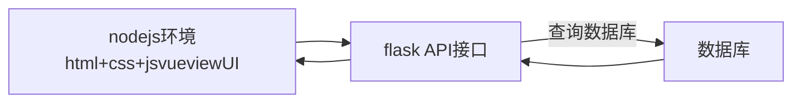
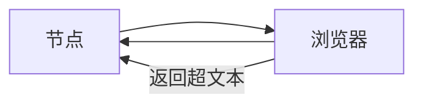

### http:超文本传输协议

​  

  
https://gw.alipayobjects.com/os/chair-script/skylark/deps.23df0f2f.chunk.css

协议//域名/访问/资源?url参数

​  

POST 新增

DELETE 删除

PUT 修改

GET 查询

HEAD 获取头部信息

OPTIONS 查看当前url支持什么方法来请求

​  

GET请求 一般将数据放在url参数中传递，放在http头部字段中

POST请求 将数据都放在body字段中

​  

### http状态码

1xx 表示请求过程中的状态

2xx 表示成功 200 请求成功得到响应

3xx 表示重定向 301 308

4xx 表示客户端错误 403 404 405 499

5xx 代表服务端错误 501 502 503

​  

#http无状态协议 不保存任何信息，当前请求与上一次请求没有任何关系

如果需要保存数据要么保存在浏览器本地要么保存在服务端

#http1.1 http2.0 http3.0

## python wsgi

WSGI 是 Python Web 开发中的一个**接口规范**（全称 Web Server Gateway Interface），它规定了**Web 服务器**（如 Nginx、Apache）与**Python Web 应用 / 框架**（如 Flask、Django）之间如何通信。

简单说，WSGI 就像一个 “翻译官”：

-   服务器接收用户请求后，按 WSGI 规则把请求数据传给 Python 应用；
-   应用处理完请求，再按 WSGI 规则把响应数据返回给服务器，最终由服务器发给用户。

它的作用是统一接口标准，让不同的服务器和 Python 框架可以自由搭配（比如 Nginx 既可以对接 Flask，也可以对接 Django），无需为特定服务器单独适配。

# nginx

Nginx 是一款**高性能的 Web 服务器**，同时也常用作反向代理、负载均衡器和 HTTP 缓存工具。

核心功能：

1.  **处理静态资源**：高效响应 HTML、CSS、图片等静态文件请求（速度快、资源占用低）。
2.  **反向代理**：接收用户请求后，转发给后端应用服务器（如 Python/Java 程序），隐藏后端服务细节。
3.  **负载均衡**：当多个服务器集群工作时，分发请求到不同服务器，避免单台过载。
4.  **高并发支持**：采用异步非阻塞架构，能同时处理大量请求，适合高流量场景（如大型网站、API 服务）。

简单说，Nginx 常作为 “前端门面”，直接对接用户请求，再合理分配给后端系统，提升整体服务的稳定性和效率。

​  

# 虚拟环境

  

# 项目

需求分析 --设计

程序状态 code

url api 参数，返回

数据库设计 数据表
